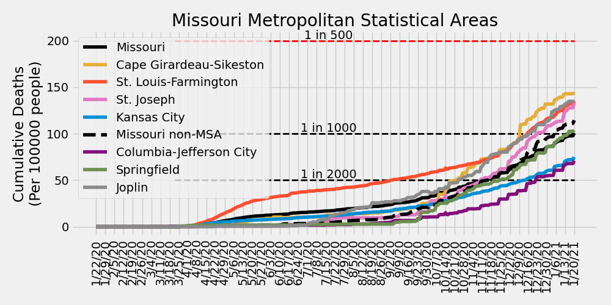
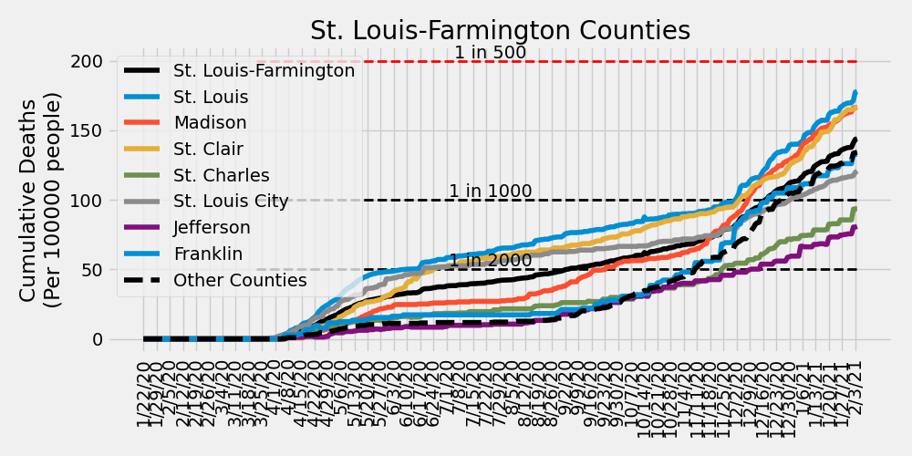

# COVID-19 Missouri Statistics & Regional Breakdowns
Author: Adam J. Vogt  
Updated: 02/05/2021  
Source: [COVID-19 Data Repository by the Center for Systems Science and Engineering (CSSE) at Johns Hopkins University](https://github.com/CSSEGISandData/COVID-19)  
Source Code: `/ajvogt-analysis/mo_analysis_script.py`  
[Release Notes found below](#release-notes)

This analysis shows the Johns Hopkins University COVID-19 data broken down by 
[Metropolitan Statistcal Area](https://en.wikipedia.org/wiki/Metropolitan_statistical_area) (MSA)
 combinations within the state of Missouri. The list of counties in each MSA comibination can be found in the 
[table](#msa-counties) 
below. The [detailed map of MSAs](https://www2.census.gov/geo/maps/metroarea/us_wall/Sep2018/CBSA_WallMap_Sep2018.pdf) 
can be found here.  The clusters used in the charts and tables below 
are a custom combination of MSAs and 
[Combined Statistical Areas](https://en.wikipedia.org/wiki/Combined_statistical_area) (CSA). 
County populations are pulled from this 
[JHU CSSE repository file](https://github.com/ajvogt/COVID-19/blob/master/csse_covid_19_data/UID_ISO_FIPS_LookUp_Table.csv).

## Missouri New Daily Confirmed Cases by Metropolitan Statistcal Areas

## Missouri New Daily Deaths by Metropolitan Statistcal Areas

## Missouri Cumulative Deaths by Metropolitan Statistcal Areas

## Missouri Metropolitan Statistical Area Totals
<!-- msa_table start -->
| MSA | Total Deaths | Total Cases | Daily New Cases: Last 7-Day Average | Daily New Cases: Last 14-Day Average | Daily New Cases: Last 30-Day Average |
|-----|-------|--------|---|---|---|
| St. Louis-Farmington | 4130 | 245703 | 757 | 887 | 1202 |
| Kansas City | 2176 | 167422 | 554 | 679 | 903 |
| Missouri non-MSA | 1810 | 107134 | 237 | 265 | 400 |
| Springfield | 553 | 35085 | 87 | 107 | 154 |
| Columbia-Jefferson City | 277 | 33600 | 78 | 82 | 112 |
| Joplin | 268 | 15781 | 51 | 53 | 64 |
| Cape Girardeau-Sikeston | 207 | 12453 | 24 | 26 | 37 |
| St. Joseph | 182 | 9897 | 23 | 26 | 34 |
<!-- msa_table end -->

## STL-Farmington MSA New Daily Confirmed Cases by County

## STL-Farmington MSA New Daily Deaths by County

## STL-Farmington MSA Cumulative Deaths by County

## Metropolitan Statistical Area (MSA) Counties
<!-- county_table start -->
| MSA | State | County | Total Deaths | Total Cases | Daily New Cases: Last 7-Day Average | Daily New Cases: Last 14-Day Average | Daily New Cases: Last 30-Day Average |
|-----|-------|--------|---|---|---|---|---|
| St. Louis-Farmington | Missouri | St. Louis | 1769 | 84532 | 243 | 332 | 421 |
| Kansas City | Kansas | Johnson | 668 | 50392 | 163 | 238 | 333 |
| Kansas City | Missouri | Kansas City | 455 | 35888 | 118 | 124 | 156 |
| Kansas City | Missouri | Jackson | 323 | 28782 | 111 | 124 | 151 |
| St. Louis-Farmington | Illinois | Madison | 437 | 26563 | 105 | 124 | 157 |
| St. Louis-Farmington | Illinois | St. Clair | 433 | 24044 | 90 | 101 | 138 |
| St. Louis-Farmington | Missouri | St. Louis City | 363 | 20540 | 75 | 55 | 80 |
| St. Louis-Farmington | Missouri | St. Charles | 376 | 31773 | 72 | 78 | 126 |
| Springfield | Missouri | Greene | 388 | 22590 | 59 | 70 | 99 |
| St. Louis-Farmington | Missouri | Jefferson | 182 | 18424 | 54 | 61 | 90 |
| Joplin | Missouri | Jasper | 206 | 11817 | 42 | 43 | 51 |
| Kansas City | Kansas | Wyandotte | 236 | 18309 | 37 | 52 | 76 |
| Columbia-Jefferson City | Missouri | Boone | 69 | 15452 | 36 | 43 | 58 |
| Kansas City | Missouri | Clay | 131 | 7576 | 26 | 27 | 36 |
| Kansas City | Kansas | Leavenworth | 64 | 6304 | 26 | 31 | 37 |
| Kansas City | Missouri | Cass | 72 | 6946 | 23 | 29 | 39 |
| St. Louis-Farmington | Missouri | Franklin | 138 | 8111 | 20 | 25 | 41 |
| St. Louis-Farmington | Illinois | Clinton | 85 | 5407 | 20 | 21 | 26 |
| St. Louis-Farmington | Illinois | Monroe | 75 | 3881 | 18 | 18 | 21 |
| Springfield | Missouri | Christian | 71 | 6663 | 17 | 22 | 30 |
| Cape Girardeau-Sikeston | Missouri | Cape Girardeau | 116 | 7301 | 16 | 16 | 22 |
| Columbia-Jefferson City | Missouri | Cole | 107 | 8412 | 15 | 15 | 21 |
| Columbia-Jefferson City | Missouri | Callaway | 37 | 4344 | 15 | 13 | 15 |
| St. Louis-Farmington | Missouri | St. Francois | 92 | 7423 | 14 | 14 | 23 |
| St. Louis-Farmington | Illinois | Macoupin | 73 | 4193 | 14 | 20 | 27 |
| St. Joseph | Missouri | Buchanan | 126 | 6822 | 13 | 16 | 21 |
| Kansas City | Missouri | Platte | 37 | 2967 | 12 | 10 | 14 |
| Missouri non-MSA | Missouri | Taney | 73 | 4458 | 11 | 13 | 18 |
| St. Louis-Farmington | Missouri | Lincoln | 27 | 4128 | 10 | 12 | 16 |
| Kansas City | Missouri | Lafayette | 48 | 2449 | 10 | 8 | 10 |
| Missouri non-MSA | Missouri | Johnson | 38 | 3709 | 9 | 9 | 13 |
| Missouri non-MSA | Missouri | Pettis | 71 | 4663 | 9 | 11 | 17 |
| Joplin | Missouri | Newton | 62 | 3964 | 9 | 9 | 13 |
| Missouri non-MSA | Missouri | Butler | 27 | 3266 | 9 | 9 | 12 |
| Missouri non-MSA | Missouri | Laclede | 61 | 2869 | 8 | 7 | 9 |
| Kansas City | Kansas | Miami | 28 | 2510 | 8 | 11 | 18 |
| Missouri non-MSA | Missouri | Camden | 75 | 3647 | 7 | 8 | 14 |
| Missouri non-MSA | Missouri | Saline | 33 | 2370 | 7 | 7 | 9 |
| Missouri non-MSA | Missouri | Stone | 33 | 1958 | 7 | 7 | 8 |
| St. Louis-Farmington | Illinois | Jersey | 44 | 2389 | 6 | 9 | 11 |
| Springfield | Missouri | Webster | 46 | 2947 | 6 | 8 | 13 |
| Missouri non-MSA | Missouri | Phelps | 114 | 2914 | 6 | 6 | 10 |
| Missouri non-MSA | Missouri | Lawrence | 64 | 2666 | 6 | 6 | 8 |
| St. Louis-Farmington | Missouri | Warren | 13 | 2012 | 6 | 7 | 10 |
| Missouri non-MSA | Missouri | Pulaski | 37 | 2933 | 5 | 4 | 11 |
| Missouri non-MSA | Missouri | Adair | 11 | 2004 | 5 | 6 | 10 |
| Missouri non-MSA | Missouri | Marion | 39 | 2601 | 5 | 4 | 6 |
| Missouri non-MSA | Missouri | Barry | 43 | 2130 | 5 | 5 | 9 |
| Cape Girardeau-Sikeston | Missouri | Scott | 71 | 3691 | 5 | 5 | 9 |
| Missouri non-MSA | Missouri | Crawford | 28 | 2005 | 4 | 5 | 7 |
| Missouri non-MSA | Missouri | Livingston | 32 | 1287 | 4 | 5 | 7 |
| Missouri non-MSA | Missouri | Henry | 30 | 1673 | 4 | 5 | 6 |
| Columbia-Jefferson City | Missouri | Cooper | 21 | 1662 | 4 | 3 | 5 |
| Kansas City | Missouri | Bates | 19 | 1050 | 4 | 4 | 5 |
| St. Joseph | Kansas | Doniphan | 13 | 909 | 4 | 4 | 5 |
| Missouri non-MSA | Missouri | Stoddard | 35 | 2242 | 4 | 5 | 6 |
| Missouri non-MSA | Missouri | Dunklin | 17 | 2362 | 3 | 5 | 7 |
| Missouri non-MSA | Missouri | Macon | 12 | 1178 | 3 | 6 | 7 |
| Kansas City | Missouri | Clinton | 60 | 1487 | 3 | 3 | 6 |
| Missouri non-MSA | Missouri | Benton | 23 | 1406 | 3 | 3 | 5 |
| Columbia-Jefferson City | Missouri | Osage | 12 | 1372 | 3 | 4 | 5 |
| Missouri non-MSA | Missouri | Ripley | 11 | 803 | 3 | 3 | 3 |
| Missouri non-MSA | Missouri | Wright | 26 | 1336 | 3 | 3 | 6 |
| Missouri non-MSA | Missouri | Carroll | 21 | 806 | 3 | 4 | 4 |
| Missouri non-MSA | Missouri | Howell | 42 | 2748 | 3 | 5 | 11 |
| Missouri non-MSA | Missouri | Barton | 10 | 931 | 3 | 3 | 4 |
| Kansas City | Missouri | Ray | 20 | 1421 | 3 | 6 | 8 |
| Missouri non-MSA | Missouri | Harrison | 14 | 808 | 3 | 4 | 5 |
| Missouri non-MSA | Missouri | Nodaway | 23 | 2525 | 3 | 2 | 5 |
| Missouri non-MSA | Missouri | Pike | 21 | 1462 | 3 | 3 | 5 |
| Missouri non-MSA | Missouri | Texas | 21 | 1515 | 3 | 2 | 4 |
| Missouri non-MSA | Missouri | McDonald | 25 | 1883 | 3 | 3 | 6 |
| Missouri non-MSA | Missouri | Ste. Genevieve | 13 | 1582 | 3 | 4 | 4 |
| Missouri non-MSA | Missouri | New Madrid | 43 | 1754 | 3 | 2 | 3 |
| Springfield | Missouri | Polk | 26 | 2087 | 3 | 4 | 7 |
| Missouri non-MSA | Missouri | Washington | 42 | 2082 | 3 | 5 | 8 |
| Missouri non-MSA | Missouri | Vernon | 33 | 1342 | 2 | 3 | 6 |
| Missouri non-MSA | Missouri | Mississippi | 22 | 1230 | 2 | 2 | 2 |
| Missouri non-MSA | Missouri | Daviess | 11 | 576 | 2 | 2 | 3 |
| St. Louis-Farmington | Illinois | Bond | 21 | 1822 | 2 | 4 | 7 |
| Missouri non-MSA | Missouri | Miller | 48 | 2291 | 2 | 4 | 6 |
| St. Joseph | Missouri | Andrew | 17 | 1260 | 2 | 2 | 4 |
| Missouri non-MSA | Missouri | Morgan | 36 | 1602 | 2 | 2 | 4 |
| Missouri non-MSA | Missouri | Perry | 22 | 2007 | 2 | 2 | 4 |
| St. Joseph | Missouri | DeKalb | 26 | 906 | 2 | 2 | 3 |
| Missouri non-MSA | Missouri | St. Clair | 7 | 566 | 2 | 3 | 2 |
| Missouri non-MSA | Missouri | Cedar | 10 | 652 | 2 | 2 | 3 |
| Missouri non-MSA | Missouri | Ozark | 11 | 531 | 2 | 2 | 4 |
| Columbia-Jefferson City | Missouri | Moniteau | 27 | 1662 | 2 | 2 | 4 |
| Missouri non-MSA | Missouri | Dent | 14 | 809 | 2 | 2 | 2 |
| Missouri non-MSA | Missouri | Grundy | 31 | 808 | 2 | 1 | 3 |
| Kansas City | Kansas | Linn | 5 | 719 | 2 | 3 | 5 |
| Cape Girardeau-Sikeston | Missouri | Bollinger | 12 | 1039 | 2 | 1 | 2 |
| Missouri non-MSA | Missouri | Madison | 15 | 1338 | 2 | 2 | 3 |
| Missouri non-MSA | Missouri | Pemiscot | 25 | 1392 | 2 | 2 | 3 |
| Missouri non-MSA | Missouri | Gasconade | 33 | 848 | 2 | 2 | 4 |
| Missouri non-MSA | Missouri | Gentry | 19 | 725 | 2 | 2 | 3 |
| Missouri non-MSA | Missouri | Clark | 6 | 451 | 2 | 1 | 2 |
| Missouri non-MSA | Missouri | Randolph | 27 | 1795 | 1 | 1 | 5 |
| Missouri non-MSA | Missouri | Shannon | 10 | 469 | 1 | 1 | 1 |
| Missouri non-MSA | Missouri | Douglas | 23 | 753 | 1 | 2 | 3 |
| Missouri non-MSA | Missouri | Linn | 10 | 531 | 1 | 2 | 3 |
| Springfield | Missouri | Dallas | 22 | 798 | 1 | 2 | 2 |
| Missouri non-MSA | Missouri | Ralls | 12 | 743 | 1 | 1 | 2 |
| Cape Girardeau-Sikeston | Illinois | Alexander | 8 | 422 | 1 | 1 | 2 |
| Missouri non-MSA | Missouri | Maries | 7 | 524 | 1 | 1 | 1 |
| Missouri non-MSA | Missouri | Audrain | 50 | 2022 | 1 | 4 | 6 |
| St. Louis-Farmington | Illinois | Calhoun | 2 | 461 | 1 | 1 | 2 |
| Missouri non-MSA | Missouri | Wayne | 9 | 792 | 1 | 1 | 3 |
| Columbia-Jefferson City | Missouri | Howard | 4 | 696 | 1 | 1 | 2 |
| Kansas City | Missouri | Caldwell | 10 | 622 | 1 | 1 | 1 |
| Missouri non-MSA | Missouri | Holt | 10 | 361 | 0 | 0 | 1 |
| Missouri non-MSA | Missouri | Shelby | 6 | 348 | 0 | 1 | 1 |
| Missouri non-MSA | Missouri | Chariton | 3 | 408 | 0 | 1 | 2 |
| Missouri non-MSA | Missouri | Schuyler | 1 | 263 | 0 | 0 | 1 |
| Missouri non-MSA | Missouri | Monroe | 8 | 582 | 0 | 1 | 1 |
| Missouri non-MSA | Missouri | Hickory | 11 | 461 | 0 | 0 | 0 |
| Missouri non-MSA | Missouri | Lewis | 3 | 621 | 0 | 0 | 2 |
| Missouri non-MSA | Missouri | Sullivan | 13 | 742 | 0 | 0 | 2 |
| Missouri non-MSA | Missouri | Knox | 2 | 175 | 0 | 0 | 0 |
| Missouri non-MSA | Missouri | Scotland | 3 | 240 | 0 | 0 | 0 |
| Missouri non-MSA | Missouri | Mercer | 2 | 165 | 0 | 0 | 1 |
| Missouri non-MSA | Missouri | Putnam | 2 | 219 | 0 | 0 | 0 |
| Missouri non-MSA | Missouri | Oregon | 3 | 662 | 0 | 1 | 3 |
| Missouri non-MSA | Missouri | Dade | 13 | 413 | 0 | 1 | 1 |
| Missouri non-MSA | Missouri | Atchison | 6 | 290 | 0 | 0 | 0 |
| Missouri non-MSA | Missouri | Reynolds | 3 | 258 | 0 | 0 | 0 |
| Missouri non-MSA | Missouri | Carter | 8 | 411 | 0 | 0 | 0 |
| Missouri non-MSA | Missouri | Montgomery | 10 | 550 | 0 | 0 | 1 |
| Missouri non-MSA | Missouri | Worth | 1 | 137 | 0 | 0 | 0 |
| Unassigned/Out of MO | Missouri | Unassigned | 0 | 0 | 0 | 0 | 0 |
| Unassigned/Out of MO | Missouri | Out of MO | 0 | 0 | 0 | 0 | 0 |
| Missouri non-MSA | Missouri | Iron | 3 | 455 | 0 | 0 | 1 |
<!-- county_table end -->

## Release Notes

### Release Notes
* 1/17/2021: including cumulative deaths plots
* 1/4/2021: small fix for including 2021 data
* 7/20/2020:
  * update table insertion code
  * fix cases vs. deaths total header bug
  * include MSA totals table
  * added STL-Farmington County-level Deaths & Cases plots
  * including release notes in missouri_analysis.md
* 7/19/2020: 
  * code refactor
  * updating color scheme for plots
  * updating county numbers to table to include
  latest new daily case average numbers and
  sorting by last 7-day average
* 6/19/2020: Added description of MSAs & CSAs
* 6/16/2020: Including individual county totals (only) in analysis md table
* 6/11/2020:
  * Updated MSA definitions
  * Including table of individual county case counts
* 6/7/2020: Creating markdown & script
  * Including list of county-MSA/CSA associations to markdown
  * Including cumulative totals in MSA/CSA plots
* 5/30/2020: including plots of cumulative cases/deaths in jupyter notebook
* 5/17/2020: Initial analysis jupyter notebook created
* 4/4/2020: Cloned JHU CSSE Repository and set up development environment

### To-Do (updated 1/17/2021)
- [ ] Verify county population data

#### Analysis Page
- [x] Update description to accurately reflect CSA vs. MSA
- [x] Make table for CSA info
- [x] Include 7, 14, & 30 day changes for each county
- [ ] Plot top CSAs (for latest daily case change) with testing data
- [x] Analysis breakdown of St. Louis-Farmington counties
- [x] Include release notes and to-do list
- [ ] ~~Update color scheme~~, plot markers, and line thickness
- [ ] Include table of contents

#### Analysis Script
- [x] Simplify data ingestion and summarization functionality
- [x] Simplify plotting functionality
- [x] Include ability to update markdown with table between markdown sections
