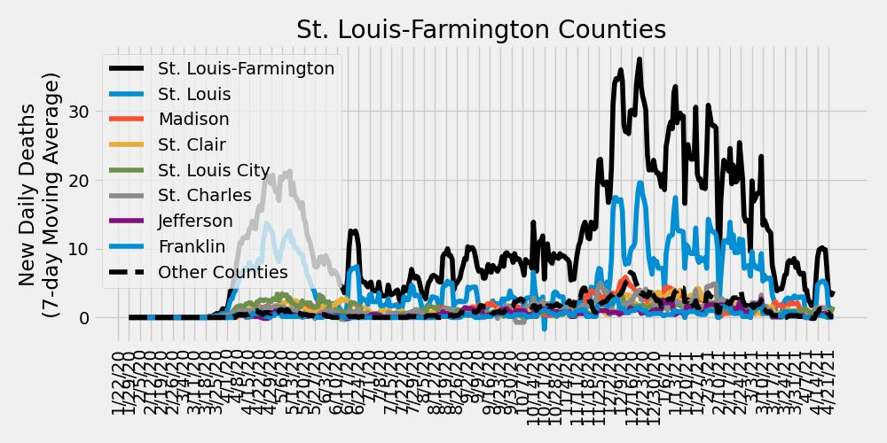

# COVID-19 Missouri Statistics & Regional Breakdowns
Author: Adam J. Vogt  
Updated: 11/21/2020  
Source: [COVID-19 Data Repository by the Center for Systems Science and Engineering (CSSE) at Johns Hopkins University](https://github.com/CSSEGISandData/COVID-19)  
Source Code: `/ajvogt-analysis/mo_analysis_script.py`  
[Release Notes found below](#release-notes)

This analysis shows the Johns Hopkins University COVID-19 data broken down by 
[Metropolitan Statistcal Area](https://en.wikipedia.org/wiki/Metropolitan_statistical_area) (MSA)
 combinations within the state of Missouri. The list of counties in each MSA comibination can be found in the 
[table](#msa-counties) 
below. The [detailed map of MSAs](https://www2.census.gov/geo/maps/metroarea/us_wall/Sep2018/CBSA_WallMap_Sep2018.pdf) 
can be found here.  The clusters used in the charts and tables below 
are a custom combination of MSAs and 
[Combined Statistical Areas](https://en.wikipedia.org/wiki/Combined_statistical_area) (CSA).

## Missouri New Daily Deaths by Metropolitan Statistcal Areas

## Missouri New Daily Confirmed Cases by Metropolitan Statistcal Areas

## Missouri Metropolitan Statistical Area Totals
<!-- msa_table start -->
| MSA | Total Deaths | Total Cases | Daily New Cases: Last 7-Day Average | Daily New Cases: Last 14-Day Average | Daily New Cases: Last 30-Day Average |
|-----|-------|--------|---|---|---|
| St. Louis-Farmington | 2164 | 127250 | 2434 | 2272 | 1659 |
| Kansas City | 1089 | 87191 | 1500 | 1398 | 1055 |
| Missouri non-MSA | 759 | 61652 | 1128 | 1073 | 861 |
| Columbia-Jefferson City | 87 | 20731 | 394 | 391 | 319 |
| Springfield | 230 | 19400 | 262 | 258 | 217 |
| Joplin | 140 | 10314 | 156 | 152 | 116 |
| Cape Girardeau-Sikeston | 104 | 7707 | 154 | 151 | 111 |
| St. Joseph | 72 | 5663 | 92 | 89 | 67 |
<!-- msa_table end -->

## STL-Farmington MSA New Daily Deaths by County

## STL-Farmington MSA New Daily Confirmed Cases by County

## Metropolitan Statistical Area (MSA) Counties
<!-- county_table start -->
| MSA | State | County | Total Deaths | Total Cases | Daily New Cases: Last 7-Day Average | Daily New Cases: Last 14-Day Average | Daily New Cases: Last 30-Day Average |
|-----|-------|--------|---|---|---|---|---|
| St. Louis-Farmington | Missouri | St. Louis | 943 | 44897 | 763 | 736 | 542 |
| Kansas City | Kansas | Johnson | 266 | 23891 | 420 | 430 | 332 |
| St. Louis-Farmington | Missouri | St. Charles | 180 | 17328 | 355 | 329 | 245 |
| Kansas City | Missouri | Kansas City | 253 | 20658 | 327 | 303 | 226 |
| Kansas City | Missouri | Jackson | 170 | 15213 | 299 | 265 | 194 |
| St. Louis-Farmington | Illinois | Madison | 213 | 12394 | 270 | 259 | 183 |
| St. Louis-Farmington | Missouri | Jefferson | 96 | 9362 | 215 | 194 | 137 |
| St. Louis-Farmington | Illinois | St. Clair | 248 | 11447 | 187 | 180 | 125 |
| St. Louis-Farmington | Missouri | St. Louis City | 230 | 11393 | 182 | 144 | 111 |
| Springfield | Missouri | Greene | 169 | 12531 | 165 | 163 | 134 |
| Columbia-Jefferson City | Missouri | Boone | 16 | 9379 | 164 | 164 | 121 |
| Kansas City | Kansas | Wyandotte | 177 | 10535 | 120 | 100 | 79 |
| Joplin | Missouri | Jasper | 103 | 7548 | 119 | 118 | 88 |
| Columbia-Jefferson City | Missouri | Cole | 38 | 5426 | 111 | 107 | 94 |
| Kansas City | Missouri | Clay | 60 | 4115 | 89 | 77 | 58 |
| St. Louis-Farmington | Missouri | St. Francois | 36 | 4499 | 87 | 81 | 60 |
| Cape Girardeau-Sikeston | Missouri | Cape Girardeau | 59 | 4407 | 87 | 90 | 63 |
| St. Louis-Farmington | Missouri | Franklin | 59 | 4247 | 83 | 76 | 61 |
| Kansas City | Missouri | Cass | 36 | 3281 | 73 | 63 | 45 |
| St. Louis-Farmington | Illinois | Macoupin | 16 | 1828 | 60 | 57 | 35 |
| St. Louis-Farmington | Illinois | Clinton | 56 | 2875 | 60 | 55 | 40 |
| St. Joseph | Missouri | Buchanan | 53 | 4095 | 58 | 59 | 43 |
| Columbia-Jefferson City | Missouri | Callaway | 7 | 2492 | 53 | 52 | 47 |
| Cape Girardeau-Sikeston | Missouri | Scott | 36 | 2326 | 52 | 45 | 33 |
| St. Louis-Farmington | Missouri | Lincoln | 8 | 2072 | 50 | 46 | 33 |
| Springfield | Missouri | Christian | 22 | 3380 | 48 | 50 | 41 |
| Kansas City | Kansas | Leavenworth | 27 | 3408 | 44 | 41 | 28 |
| Missouri non-MSA | Missouri | Taney | 37 | 2523 | 39 | 37 | 31 |
| St. Louis-Farmington | Illinois | Monroe | 44 | 1713 | 38 | 38 | 28 |
| Missouri non-MSA | Missouri | Butler | 8 | 1891 | 37 | 29 | 28 |
| Missouri non-MSA | Missouri | Stoddard | 19 | 1418 | 37 | 29 | 20 |
| Joplin | Missouri | Newton | 37 | 2766 | 36 | 33 | 28 |
| Missouri non-MSA | Missouri | Johnson | 12 | 2261 | 35 | 35 | 28 |
| Missouri non-MSA | Missouri | Perry | 8 | 1372 | 34 | 27 | 20 |
| Missouri non-MSA | Missouri | Phelps | 38 | 1449 | 33 | 31 | 22 |
| Missouri non-MSA | Missouri | Washington | 22 | 1256 | 33 | 31 | 21 |
| Missouri non-MSA | Missouri | Camden | 44 | 2252 | 32 | 33 | 25 |
| Missouri non-MSA | Missouri | Lawrence | 33 | 1742 | 32 | 29 | 24 |
| Missouri non-MSA | Missouri | Marion | 15 | 1549 | 31 | 30 | 23 |
| Missouri non-MSA | Missouri | Nodaway | 11 | 1798 | 27 | 27 | 25 |
| Missouri non-MSA | Missouri | Henry | 9 | 933 | 27 | 29 | 19 |
| Springfield | Missouri | Webster | 23 | 1644 | 26 | 23 | 19 |
| Kansas City | Missouri | Platte | 14 | 1459 | 26 | 21 | 17 |
| St. Louis-Farmington | Illinois | Jersey | 23 | 1061 | 26 | 25 | 19 |
| St. Louis-Farmington | Missouri | Warren | 2 | 1030 | 26 | 21 | 14 |
| Missouri non-MSA | Missouri | Barry | 22 | 1333 | 26 | 24 | 19 |
| Missouri non-MSA | Missouri | Randolph | 5 | 1075 | 25 | 22 | 17 |
| Missouri non-MSA | Missouri | Pike | 8 | 767 | 24 | 23 | 15 |
| Missouri non-MSA | Missouri | New Madrid | 23 | 1204 | 24 | 21 | 16 |
| Missouri non-MSA | Missouri | Pulaski | 15 | 1418 | 24 | 19 | 17 |
| Missouri non-MSA | Missouri | Saline | 12 | 1442 | 23 | 24 | 17 |
| Missouri non-MSA | Missouri | Adair | 0 | 976 | 22 | 23 | 16 |
| Columbia-Jefferson City | Missouri | Moniteau | 15 | 1110 | 22 | 23 | 20 |
| Missouri non-MSA | Missouri | Miller | 23 | 1369 | 22 | 21 | 19 |
| Missouri non-MSA | Missouri | Ste. Genevieve | 2 | 909 | 22 | 23 | 19 |
| Kansas City | Missouri | Lafayette | 29 | 1331 | 21 | 21 | 19 |
| Missouri non-MSA | Missouri | Crawford | 11 | 1056 | 21 | 20 | 16 |
| Missouri non-MSA | Missouri | Macon | 2 | 544 | 20 | 17 | 11 |
| Missouri non-MSA | Missouri | Dunklin | 13 | 1558 | 20 | 18 | 17 |
| Missouri non-MSA | Missouri | Laclede | 29 | 1637 | 20 | 20 | 18 |
| Missouri non-MSA | Missouri | Stone | 15 | 1058 | 18 | 16 | 13 |
| Missouri non-MSA | Missouri | Pettis | 29 | 2521 | 18 | 34 | 34 |
| Missouri non-MSA | Missouri | Mississippi | 6 | 684 | 18 | 12 | 9 |
| Columbia-Jefferson City | Missouri | Cooper | 6 | 1062 | 18 | 19 | 16 |
| St. Louis-Farmington | Illinois | Bond | 10 | 898 | 17 | 19 | 13 |
| Kansas City | Kansas | Miami | 2 | 866 | 17 | 15 | 11 |
| Missouri non-MSA | Missouri | Audrain | 11 | 921 | 15 | 15 | 12 |
| Columbia-Jefferson City | Missouri | Osage | 3 | 840 | 15 | 15 | 13 |
| St. Joseph | Missouri | Andrew | 8 | 681 | 14 | 12 | 9 |
| Kansas City | Missouri | Ray | 4 | 602 | 14 | 15 | 11 |
| Kansas City | Missouri | Clinton | 41 | 800 | 14 | 13 | 12 |
| Kansas City | Missouri | Bates | 8 | 450 | 13 | 11 | 7 |
| Missouri non-MSA | Missouri | Grundy | 13 | 459 | 13 | 9 | 7 |
| Missouri non-MSA | Missouri | Howell | 26 | 1499 | 13 | 12 | 15 |
| Springfield | Missouri | Polk | 11 | 1292 | 13 | 12 | 13 |
| Missouri non-MSA | Missouri | Pemiscot | 16 | 1003 | 13 | 14 | 10 |
| Missouri non-MSA | Missouri | Morgan | 9 | 972 | 13 | 12 | 12 |
| Missouri non-MSA | Missouri | Madison | 7 | 736 | 12 | 11 | 9 |
| Missouri non-MSA | Missouri | Ralls | 1 | 393 | 11 | 10 | 6 |
| Missouri non-MSA | Missouri | Harrison | 1 | 350 | 11 | 10 | 5 |
| Missouri non-MSA | Missouri | Texas | 7 | 880 | 11 | 12 | 11 |
| Cape Girardeau-Sikeston | Missouri | Bollinger | 7 | 741 | 11 | 11 | 10 |
| Missouri non-MSA | Missouri | Dent | 4 | 427 | 11 | 9 | 6 |
| Missouri non-MSA | Missouri | St. Clair | 1 | 282 | 10 | 9 | 5 |
| Kansas City | Missouri | Caldwell | 1 | 334 | 10 | 8 | 5 |
| Missouri non-MSA | Missouri | Vernon | 5 | 590 | 10 | 12 | 9 |
| St. Joseph | Kansas | Doniphan | 2 | 391 | 9 | 10 | 6 |
| Missouri non-MSA | Missouri | Lewis | 2 | 404 | 9 | 10 | 7 |
| Missouri non-MSA | Missouri | Livingston | 11 | 714 | 9 | 7 | 5 |
| Missouri non-MSA | Missouri | Cedar | 4 | 411 | 9 | 9 | 6 |
| St. Joseph | Missouri | DeKalb | 9 | 496 | 9 | 7 | 7 |
| Missouri non-MSA | Missouri | Gentry | 11 | 355 | 9 | 9 | 6 |
| Columbia-Jefferson City | Missouri | Howard | 2 | 422 | 9 | 8 | 6 |
| Missouri non-MSA | Missouri | Carroll | 5 | 353 | 8 | 7 | 6 |
| St. Louis-Farmington | Illinois | Calhoun | 0 | 206 | 8 | 6 | 4 |
| Missouri non-MSA | Missouri | Sullivan | 5 | 526 | 8 | 7 | 8 |
| Missouri non-MSA | Missouri | Ripley | 5 | 448 | 8 | 9 | 7 |
| Missouri non-MSA | Missouri | Chariton | 0 | 214 | 8 | 7 | 5 |
| Missouri non-MSA | Missouri | Benton | 8 | 711 | 8 | 11 | 8 |
| Springfield | Missouri | Dallas | 5 | 553 | 8 | 8 | 8 |
| Missouri non-MSA | Missouri | Barton | 4 | 588 | 7 | 7 | 6 |
| Missouri non-MSA | Missouri | Clark | 2 | 260 | 7 | 7 | 5 |
| Missouri non-MSA | Missouri | Wayne | 3 | 441 | 7 | 6 | 4 |
| Missouri non-MSA | Missouri | Monroe | 3 | 326 | 7 | 7 | 6 |
| Missouri non-MSA | Missouri | Linn | 10 | 280 | 7 | 6 | 4 |
| Missouri non-MSA | Missouri | Atchison | 1 | 180 | 6 | 5 | 3 |
| Kansas City | Kansas | Linn | 1 | 248 | 6 | 6 | 4 |
| Missouri non-MSA | Missouri | Scotland | 1 | 168 | 6 | 5 | 3 |
| Missouri non-MSA | Missouri | Holt | 2 | 226 | 6 | 5 | 3 |
| Missouri non-MSA | Missouri | Maries | 2 | 324 | 6 | 6 | 5 |
| Missouri non-MSA | Missouri | Gasconade | 24 | 404 | 6 | 6 | 5 |
| Missouri non-MSA | Missouri | Wright | 12 | 717 | 5 | 5 | 5 |
| Missouri non-MSA | Missouri | Oregon | 0 | 343 | 5 | 4 | 4 |
| Missouri non-MSA | Missouri | Dade | 5 | 263 | 5 | 6 | 4 |
| Missouri non-MSA | Missouri | Iron | 0 | 199 | 5 | 4 | 3 |
| Missouri non-MSA | Missouri | Montgomery | 5 | 287 | 5 | 4 | 5 |
| Missouri non-MSA | Missouri | Carter | 4 | 259 | 5 | 4 | 3 |
| Missouri non-MSA | Missouri | McDonald | 15 | 1340 | 5 | 4 | 4 |
| Missouri non-MSA | Missouri | Hickory | 4 | 343 | 4 | 5 | 5 |
| Cape Girardeau-Sikeston | Illinois | Alexander | 2 | 233 | 4 | 4 | 4 |
| Missouri non-MSA | Missouri | Douglas | 15 | 377 | 3 | 4 | 3 |
| Missouri non-MSA | Missouri | Reynolds | 2 | 152 | 3 | 3 | 3 |
| Missouri non-MSA | Missouri | Knox | 1 | 120 | 3 | 2 | 2 |
| Missouri non-MSA | Missouri | Daviess | 7 | 301 | 3 | 3 | 3 |
| Missouri non-MSA | Missouri | Shelby | 1 | 172 | 3 | 3 | 2 |
| Missouri non-MSA | Missouri | Putnam | 1 | 109 | 3 | 3 | 2 |
| Missouri non-MSA | Missouri | Ozark | 2 | 266 | 2 | 2 | 2 |
| Missouri non-MSA | Missouri | Schuyler | 0 | 118 | 2 | 3 | 2 |
| Missouri non-MSA | Missouri | Worth | 0 | 58 | 2 | 1 | 1 |
| Missouri non-MSA | Missouri | Mercer | 0 | 68 | 1 | 2 | 1 |
| Missouri non-MSA | Missouri | Shannon | 10 | 320 | 1 | 2 | 3 |
| Unassigned/Out of MO | Missouri | Out of MO | 0 | 0 | 0 | 0 | 0 |
| Unassigned/Out of MO | Missouri | Unassigned | 0 | 0 | 0 | 0 | 0 |
<!-- county_table end -->

## Release Notes

### Release Notes
* 7/20/2020:
  * update table insertion code
  * fix cases vs. deaths total header bug
  * include MSA totals table
  * added STL-Farmington County-level Deaths & Cases plots
  * including release notes in missouri_analysis.md
* 7/19/2020: 
  * code refactor
  * updating color scheme for plots
  * updating county numbers to table to include
  latest new daily case average numbers and
  sorting by last 7-day average
* 6/19/2020: Added description of MSAs & CSAs
* 6/16/2020: Including individual county totals (only) in analysis md table
* 6/11/2020:
  * Updated MSA definitions
  * Including table of individual county case counts
* 6/7/2020: Creating markdown & script
  * Including list of county-MSA/CSA associations to markdown
  * Including cumulative totals in MSA/CSA plots
* 5/30/2020: including plots of cumulative cases/deaths in jupyter notebook
* 5/17/2020: Initial analysis jupyter notebook created
* 4/4/2020: Cloned JHU CSSE Repository and set up development environment

### To-Do (updated 7/20/2020)

#### Analysis Page
- [ ] Update description to accurately reflect CSA vs. MSA
- [x] Make table for CSA info
- [x] Include 7, 14, & 30 day changes for each county
- [ ] Plot top CSAs (for latest daily case change) with testing data
- [x] Analysis breakdown of St. Louis-Farmington counties
- [x] Include release notes and to-do list
- [ ] ~~Update color scheme~~, plot markers, and line thickness
- [ ] Include table of contents

#### Analysis Script
- [x] Simplify data ingestion and summarization functionality
- [x] Simplify plotting functionality
- [x] Include ability to update markdown with table between markdown sections
