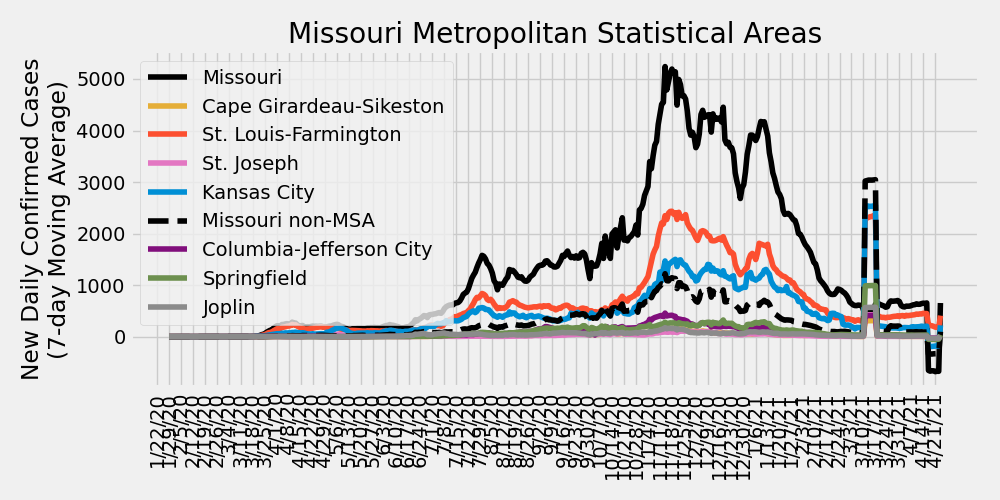

# COVID-19 Missouri Statistics & Regional Breakdowns
Author: Adam J. Vogt  
Updated: 12/24/2020  
Source: [COVID-19 Data Repository by the Center for Systems Science and Engineering (CSSE) at Johns Hopkins University](https://github.com/CSSEGISandData/COVID-19)  
Source Code: `/ajvogt-analysis/mo_analysis_script.py`  
[Release Notes found below](#release-notes)

This analysis shows the Johns Hopkins University COVID-19 data broken down by 
[Metropolitan Statistcal Area](https://en.wikipedia.org/wiki/Metropolitan_statistical_area) (MSA)
 combinations within the state of Missouri. The list of counties in each MSA comibination can be found in the 
[table](#msa-counties) 
below. The [detailed map of MSAs](https://www2.census.gov/geo/maps/metroarea/us_wall/Sep2018/CBSA_WallMap_Sep2018.pdf) 
can be found here.  The clusters used in the charts and tables below 
are a custom combination of MSAs and 
[Combined Statistical Areas](https://en.wikipedia.org/wiki/Combined_statistical_area) (CSA).

## Missouri New Daily Deaths by Metropolitan Statistcal Areas

## Missouri New Daily Confirmed Cases by Metropolitan Statistcal Areas

## Missouri Metropolitan Statistical Area Totals
<!-- msa_table start -->
| MSA | Total Deaths | Total Cases | Daily New Cases: Last 7-Day Average | Daily New Cases: Last 14-Day Average | Daily New Cases: Last 30-Day Average |
|-----|-------|--------|---|---|---|
| St. Louis-Farmington | 3153 | 191074 | 1654 | 1782 | 1907 |
| Kansas City | 1497 | 127872 | 1165 | 1191 | 1223 |
| Missouri non-MSA | 1303 | 87749 | 684 | 751 | 773 |
| Springfield | 372 | 27653 | 259 | 256 | 250 |
| Columbia-Jefferson City | 193 | 28209 | 198 | 194 | 219 |
| Joplin | 197 | 12903 | 74 | 65 | 73 |
| Cape Girardeau-Sikeston | 168 | 10638 | 65 | 68 | 84 |
| St. Joseph | 125 | 8255 | 49 | 55 | 74 |
<!-- msa_table end -->

## STL-Farmington MSA New Daily Deaths by County

## STL-Farmington MSA New Daily Confirmed Cases by County

## Metropolitan Statistical Area (MSA) Counties
<!-- county_table start -->
| MSA | State | County | Total Deaths | Total Cases | Daily New Cases: Last 7-Day Average | Daily New Cases: Last 14-Day Average | Daily New Cases: Last 30-Day Average |
|-----|-------|--------|---|---|---|---|---|
| St. Louis-Farmington | Missouri | St. Louis | 1324 | 65794 | 545 | 589 | 628 |
| Kansas City | Kansas | Johnson | 410 | 36727 | 394 | 398 | 390 |
| St. Louis-Farmington | Missouri | St. Charles | 270 | 25923 | 236 | 240 | 253 |
| St. Louis-Farmington | Illinois | Madison | 366 | 19793 | 200 | 216 | 223 |
| Kansas City | Missouri | Kansas City | 347 | 28545 | 190 | 201 | 231 |
| Kansas City | Missouri | Jackson | 222 | 22116 | 171 | 185 | 206 |
| Springfield | Missouri | Greene | 251 | 17801 | 163 | 162 | 160 |
| Kansas City | Kansas | Wyandotte | 190 | 14857 | 146 | 148 | 131 |
| St. Louis-Farmington | Illinois | St. Clair | 325 | 17866 | 141 | 169 | 192 |
| St. Louis-Farmington | Missouri | St. Louis City | 289 | 16222 | 127 | 132 | 142 |
| St. Louis-Farmington | Missouri | Jefferson | 126 | 14297 | 118 | 128 | 145 |
| Columbia-Jefferson City | Missouri | Boone | 42 | 12736 | 96 | 99 | 100 |
| Springfield | Missouri | Christian | 44 | 5154 | 60 | 58 | 54 |
| St. Louis-Farmington | Missouri | Franklin | 109 | 6174 | 57 | 56 | 56 |
| Kansas City | Missouri | Cass | 52 | 5194 | 56 | 58 | 58 |
| Joplin | Missouri | Jasper | 154 | 9573 | 53 | 49 | 57 |
| St. Louis-Farmington | Missouri | St. Francois | 68 | 6197 | 48 | 51 | 49 |
| Kansas City | Missouri | Clay | 91 | 5868 | 45 | 49 | 50 |
| Cape Girardeau-Sikeston | Missouri | Cape Girardeau | 94 | 6161 | 43 | 43 | 50 |
| Missouri non-MSA | Missouri | Pulaski | 27 | 2463 | 41 | 33 | 32 |
| Kansas City | Kansas | Leavenworth | 38 | 4823 | 38 | 39 | 44 |
| Columbia-Jefferson City | Missouri | Cole | 85 | 7305 | 37 | 38 | 53 |
| St. Louis-Farmington | Missouri | Lincoln | 18 | 3357 | 36 | 39 | 38 |
| Missouri non-MSA | Missouri | Pettis | 60 | 3836 | 35 | 49 | 41 |
| St. Louis-Farmington | Illinois | Clinton | 79 | 4267 | 32 | 36 | 42 |
| St. Louis-Farmington | Illinois | Monroe | 56 | 2878 | 32 | 34 | 33 |
| Columbia-Jefferson City | Missouri | Callaway | 19 | 3564 | 30 | 26 | 32 |
| St. Joseph | Missouri | Buchanan | 89 | 5816 | 28 | 36 | 50 |
| St. Louis-Farmington | Illinois | Macoupin | 61 | 3071 | 27 | 30 | 38 |
| Kansas City | Kansas | Miami | 10 | 1648 | 27 | 25 | 24 |
| Missouri non-MSA | Missouri | Phelps | 82 | 2324 | 24 | 21 | 24 |
| Kansas City | Missouri | Platte | 20 | 2202 | 23 | 21 | 22 |
| Missouri non-MSA | Missouri | Taney | 51 | 3608 | 22 | 25 | 31 |
| St. Louis-Farmington | Illinois | Jersey | 35 | 1853 | 21 | 21 | 24 |
| Missouri non-MSA | Missouri | Audrain | 31 | 1537 | 21 | 19 | 18 |
| Kansas City | Missouri | Lafayette | 38 | 1951 | 20 | 17 | 18 |
| Missouri non-MSA | Missouri | Johnson | 27 | 3085 | 20 | 22 | 25 |
| Joplin | Missouri | Newton | 43 | 3330 | 20 | 15 | 15 |
| Missouri non-MSA | Missouri | Camden | 60 | 2977 | 20 | 19 | 21 |
| Springfield | Missouri | Webster | 38 | 2286 | 20 | 19 | 18 |
| Missouri non-MSA | Missouri | Laclede | 44 | 2388 | 20 | 22 | 23 |
| Missouri non-MSA | Missouri | Miller | 42 | 1942 | 19 | 17 | 17 |
| Missouri non-MSA | Missouri | Crawford | 19 | 1561 | 18 | 16 | 14 |
| Cape Girardeau-Sikeston | Missouri | Scott | 57 | 3215 | 17 | 17 | 25 |
| Missouri non-MSA | Missouri | Saline | 21 | 1917 | 16 | 15 | 14 |
| Kansas City | Missouri | Ray | 7 | 1024 | 16 | 14 | 13 |
| Missouri non-MSA | Missouri | Adair | 4 | 1485 | 16 | 19 | 15 |
| St. Louis-Farmington | Missouri | Warren | 9 | 1549 | 14 | 15 | 14 |
| Missouri non-MSA | Missouri | Marion | 24 | 2244 | 14 | 16 | 20 |
| Missouri non-MSA | Missouri | Stone | 23 | 1531 | 14 | 13 | 13 |
| Missouri non-MSA | Missouri | Texas | 13 | 1267 | 14 | 14 | 11 |
| Missouri non-MSA | Missouri | Butler | 14 | 2704 | 13 | 19 | 24 |
| Columbia-Jefferson City | Missouri | Cooper | 20 | 1440 | 13 | 12 | 11 |
| St. Louis-Farmington | Illinois | Bond | 16 | 1475 | 13 | 15 | 18 |
| Missouri non-MSA | Missouri | Lawrence | 47 | 2224 | 13 | 12 | 13 |
| Missouri non-MSA | Missouri | Henry | 21 | 1373 | 13 | 11 | 12 |
| Missouri non-MSA | Missouri | Howell | 36 | 2182 | 12 | 35 | 22 |
| Missouri non-MSA | Missouri | Barry | 35 | 1734 | 12 | 11 | 11 |
| Springfield | Missouri | Polk | 21 | 1737 | 12 | 12 | 14 |
| Missouri non-MSA | Missouri | Nodaway | 18 | 2280 | 11 | 10 | 14 |
| Missouri non-MSA | Missouri | Randolph | 15 | 1538 | 11 | 12 | 13 |
| Missouri non-MSA | Missouri | Morgan | 21 | 1393 | 11 | 12 | 12 |
| Missouri non-MSA | Missouri | Ste. Genevieve | 3 | 1347 | 11 | 11 | 12 |
| Kansas City | Missouri | Clinton | 55 | 1179 | 11 | 11 | 11 |
| Missouri non-MSA | Missouri | Benton | 16 | 1141 | 10 | 14 | 13 |
| Missouri non-MSA | Missouri | Vernon | 16 | 908 | 10 | 9 | 9 |
| Missouri non-MSA | Missouri | Pike | 14 | 1209 | 10 | 11 | 13 |
| Kansas City | Missouri | Bates | 10 | 751 | 9 | 8 | 8 |
| Missouri non-MSA | Missouri | McDonald | 18 | 1598 | 9 | 8 | 7 |
| Missouri non-MSA | Missouri | Washington | 36 | 1700 | 9 | 9 | 12 |
| St. Joseph | Kansas | Doniphan | 5 | 673 | 9 | 6 | 7 |
| Missouri non-MSA | Missouri | Perry | 19 | 1795 | 9 | 10 | 11 |
| Missouri non-MSA | Missouri | Livingston | 21 | 970 | 9 | 8 | 7 |
| Missouri non-MSA | Missouri | Madison | 10 | 1123 | 9 | 9 | 10 |
| Columbia-Jefferson City | Missouri | Osage | 8 | 1130 | 8 | 7 | 8 |
| Missouri non-MSA | Missouri | Wright | 23 | 978 | 8 | 9 | 8 |
| St. Joseph | Missouri | Andrew | 13 | 1037 | 8 | 8 | 10 |
| Missouri non-MSA | Missouri | New Madrid | 28 | 1553 | 7 | 8 | 9 |
| Kansas City | Kansas | Linn | 3 | 475 | 7 | 7 | 7 |
| Missouri non-MSA | Missouri | Iron | 1 | 363 | 7 | 6 | 4 |
| Missouri non-MSA | Missouri | Macon | 8 | 868 | 7 | 8 | 8 |
| Missouri non-MSA | Missouri | Dunklin | 15 | 2008 | 7 | 14 | 13 |
| Columbia-Jefferson City | Missouri | Moniteau | 17 | 1435 | 7 | 7 | 9 |
| Missouri non-MSA | Missouri | Stoddard | 32 | 1969 | 7 | 10 | 15 |
| Missouri non-MSA | Missouri | Carroll | 14 | 616 | 7 | 7 | 7 |
| Missouri non-MSA | Missouri | Harrison | 7 | 585 | 6 | 7 | 7 |
| Missouri non-MSA | Missouri | Douglas | 19 | 580 | 6 | 7 | 6 |
| Missouri non-MSA | Missouri | Mississippi | 11 | 1100 | 6 | 7 | 10 |
| Missouri non-MSA | Missouri | Gasconade | 29 | 632 | 5 | 6 | 7 |
| Kansas City | Missouri | Caldwell | 4 | 512 | 5 | 4 | 5 |
| Missouri non-MSA | Missouri | Ralls | 6 | 621 | 5 | 5 | 6 |
| Missouri non-MSA | Missouri | Dent | 7 | 659 | 5 | 5 | 6 |
| Missouri non-MSA | Missouri | Grundy | 22 | 638 | 5 | 5 | 5 |
| Missouri non-MSA | Missouri | Gentry | 15 | 571 | 5 | 5 | 6 |
| Missouri non-MSA | Missouri | Wayne | 6 | 633 | 5 | 5 | 5 |
| Missouri non-MSA | Missouri | Montgomery | 8 | 462 | 4 | 5 | 5 |
| Missouri non-MSA | Missouri | Daviess | 9 | 444 | 4 | 4 | 4 |
| Missouri non-MSA | Missouri | Sullivan | 9 | 638 | 4 | 3 | 3 |
| Missouri non-MSA | Missouri | Barton | 9 | 735 | 4 | 4 | 4 |
| Columbia-Jefferson City | Missouri | Howard | 2 | 599 | 4 | 3 | 5 |
| Missouri non-MSA | Missouri | Chariton | 2 | 311 | 4 | 3 | 3 |
| Missouri non-MSA | Missouri | Pemiscot | 20 | 1243 | 4 | 5 | 7 |
| Missouri non-MSA | Missouri | St. Clair | 4 | 425 | 3 | 3 | 4 |
| St. Joseph | Missouri | DeKalb | 18 | 729 | 3 | 5 | 6 |
| Missouri non-MSA | Missouri | Lewis | 3 | 509 | 3 | 2 | 3 |
| Missouri non-MSA | Missouri | Dade | 8 | 350 | 3 | 2 | 2 |
| Springfield | Missouri | Dallas | 18 | 675 | 3 | 3 | 3 |
| Missouri non-MSA | Missouri | Monroe | 5 | 482 | 2 | 3 | 4 |
| Missouri non-MSA | Missouri | Maries | 6 | 439 | 2 | 2 | 3 |
| Missouri non-MSA | Missouri | Oregon | 3 | 502 | 2 | 6 | 5 |
| Missouri non-MSA | Missouri | Ripley | 8 | 636 | 2 | 3 | 5 |
| Cape Girardeau-Sikeston | Missouri | Bollinger | 11 | 934 | 2 | 3 | 5 |
| Missouri non-MSA | Missouri | Shannon | 9 | 400 | 2 | 2 | 2 |
| Cape Girardeau-Sikeston | Illinois | Alexander | 6 | 328 | 2 | 3 | 2 |
| Missouri non-MSA | Missouri | Cedar | 8 | 487 | 2 | 2 | 1 |
| Missouri non-MSA | Missouri | Mercer | 1 | 123 | 2 | 1 | 1 |
| Missouri non-MSA | Missouri | Carter | 6 | 362 | 1 | 2 | 2 |
| Missouri non-MSA | Missouri | Shelby | 3 | 281 | 1 | 1 | 3 |
| Missouri non-MSA | Missouri | Linn | 11 | 397 | 1 | 2 | 3 |
| Missouri non-MSA | Missouri | Reynolds | 2 | 218 | 1 | 1 | 2 |
| Missouri non-MSA | Missouri | Clark | 4 | 348 | 1 | 1 | 2 |
| Missouri non-MSA | Missouri | Hickory | 9 | 415 | 1 | 1 | 2 |
| Missouri non-MSA | Missouri | Schuyler | 1 | 185 | 1 | 2 | 2 |
| St. Louis-Farmington | Illinois | Calhoun | 2 | 358 | 1 | 3 | 4 |
| Missouri non-MSA | Missouri | Scotland | 3 | 222 | 1 | 1 | 1 |
| Missouri non-MSA | Missouri | Ozark | 4 | 355 | 1 | 2 | 2 |
| Missouri non-MSA | Missouri | Putnam | 1 | 191 | 1 | 1 | 2 |
| Missouri non-MSA | Missouri | Holt | 9 | 318 | 1 | 1 | 2 |
| Missouri non-MSA | Missouri | Worth | 1 | 111 | 0 | 1 | 1 |
| Missouri non-MSA | Missouri | Knox | 1 | 147 | 0 | 0 | 0 |
| Missouri non-MSA | Missouri | Atchison | 5 | 255 | 0 | 1 | 2 |
| Unassigned/Out of MO | Missouri | Unassigned | 0 | 0 | 0 | 0 | 0 |
| Unassigned/Out of MO | Missouri | Out of MO | 0 | 0 | 0 | 0 | 0 |
<!-- county_table end -->

## Release Notes

### Release Notes
* 7/20/2020:
  * update table insertion code
  * fix cases vs. deaths total header bug
  * include MSA totals table
  * added STL-Farmington County-level Deaths & Cases plots
  * including release notes in missouri_analysis.md
* 7/19/2020: 
  * code refactor
  * updating color scheme for plots
  * updating county numbers to table to include
  latest new daily case average numbers and
  sorting by last 7-day average
* 6/19/2020: Added description of MSAs & CSAs
* 6/16/2020: Including individual county totals (only) in analysis md table
* 6/11/2020:
  * Updated MSA definitions
  * Including table of individual county case counts
* 6/7/2020: Creating markdown & script
  * Including list of county-MSA/CSA associations to markdown
  * Including cumulative totals in MSA/CSA plots
* 5/30/2020: including plots of cumulative cases/deaths in jupyter notebook
* 5/17/2020: Initial analysis jupyter notebook created
* 4/4/2020: Cloned JHU CSSE Repository and set up development environment

### To-Do (updated 7/20/2020)

#### Analysis Page
- [ ] Update description to accurately reflect CSA vs. MSA
- [x] Make table for CSA info
- [x] Include 7, 14, & 30 day changes for each county
- [ ] Plot top CSAs (for latest daily case change) with testing data
- [x] Analysis breakdown of St. Louis-Farmington counties
- [x] Include release notes and to-do list
- [ ] ~~Update color scheme~~, plot markers, and line thickness
- [ ] Include table of contents

#### Analysis Script
- [x] Simplify data ingestion and summarization functionality
- [x] Simplify plotting functionality
- [x] Include ability to update markdown with table between markdown sections
