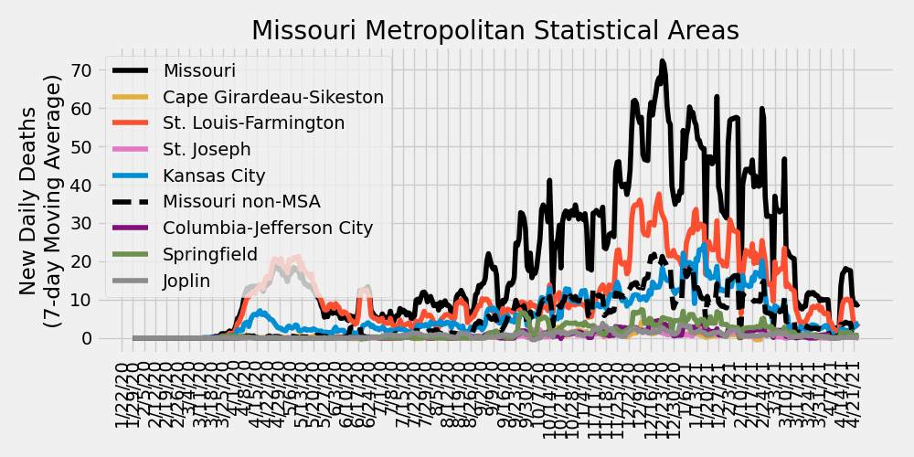

# COVID-19 Missouri Statistics & Regional Breakdowns
Author: Adam J. Vogt  
Updated: 10/05/2020  
Source: [COVID-19 Data Repository by the Center for Systems Science and Engineering (CSSE) at Johns Hopkins University](https://github.com/CSSEGISandData/COVID-19)  
Source Code: `/ajvogt-analysis/mo_analysis_script.py`  
[Release Notes found below](#release-notes)

This analysis shows the Johns Hopkins University COVID-19 data broken down by 
[Metropolitan Statistcal Area](https://en.wikipedia.org/wiki/Metropolitan_statistical_area) (MSA)
 combinations within the state of Missouri. The list of counties in each MSA comibination can be found in the 
[table](#msa-counties) 
below. The [detailed map of MSAs](https://www2.census.gov/geo/maps/metroarea/us_wall/Sep2018/CBSA_WallMap_Sep2018.pdf) 
can be found here.  The clusters used in the charts and tables below 
are a custom combination of MSAs and 
[Combined Statistical Areas](https://en.wikipedia.org/wiki/Combined_statistical_area) (CSA).

## Missouri New Daily Deaths by Metropolitan Statistcal Areas

## Missouri New Daily Confirmed Cases by Metropolitan Statistcal Areas

## Missouri Metropolitan Statistical Area Totals
<!-- msa_table start -->
| MSA | Total Deaths | Total Cases | Daily New Cases: Last 7-Day Average | Daily New Cases: Last 14-Day Average | Daily New Cases: Last 30-Day Average |
|-----|-------|--------|---|---|---|
| St. Louis-Farmington | 1683 | 67049 | 486 | 520 | 538 |
| Kansas City | 641 | 47252 | 437 | 414 | 377 |
| Missouri non-MSA | 334 | 27616 | 363 | 404 | 386 |
| Springfield | 80 | 10255 | 142 | 177 | 171 |
| Joplin | 65 | 5697 | 57 | 59 | 66 |
| Cape Girardeau-Sikeston | 37 | 3379 | 41 | 48 | 50 |
| St. Joseph | 35 | 2797 | 41 | 43 | 38 |
| Columbia-Jefferson City | 38 | 8210 | 31 | 65 | 101 |
<!-- msa_table end -->

## STL-Farmington MSA New Daily Deaths by County

## STL-Farmington MSA New Daily Confirmed Cases by County

## Metropolitan Statistical Area (MSA) Counties
<!-- county_table start -->
| MSA | State | County | Total Deaths | Total Cases | Daily New Cases: Last 7-Day Average | Daily New Cases: Last 14-Day Average | Daily New Cases: Last 30-Day Average |
|-----|-------|--------|---|---|---|---|---|
| Kansas City | Missouri | Kansas City | 143 | 12387 | 177 | 131 | 93 |
| St. Louis-Farmington | Missouri | St. Louis | 819 | 25110 | 143 | 162 | 164 |
| Kansas City | Kansas | Johnson | 158 | 11624 | 96 | 103 | 100 |
| Springfield | Missouri | Greene | 65 | 6906 | 84 | 108 | 109 |
| St. Louis-Farmington | Missouri | Jefferson | 66 | 4762 | 74 | 65 | 61 |
| Joplin | Missouri | Jasper | 52 | 4260 | 64 | 52 | 55 |
| St. Louis-Farmington | Missouri | St. Charles | 115 | 8039 | 51 | 63 | 67 |
| Kansas City | Kansas | Wyandotte | 134 | 7260 | 47 | 41 | 35 |
| St. Louis-Farmington | Illinois | St. Clair | 196 | 6905 | 42 | 44 | 44 |
| St. Louis-Farmington | Illinois | Madison | 147 | 5992 | 42 | 46 | 53 |
| Kansas City | Missouri | Jackson | 103 | 7766 | 36 | 50 | 64 |
| St. Louis-Farmington | Missouri | St. Louis City | 213 | 7287 | 31 | 32 | 31 |
| St. Joseph | Missouri | Buchanan | 30 | 2219 | 30 | 33 | 28 |
| Kansas City | Kansas | Leavenworth | 13 | 2235 | 28 | 25 | 17 |
| Columbia-Jefferson City | Missouri | Cole | 14 | 1753 | 27 | 27 | 27 |
| Cape Girardeau-Sikeston | Missouri | Cape Girardeau | 18 | 1969 | 27 | 33 | 31 |
| Springfield | Missouri | Christian | 6 | 1641 | 26 | 29 | 29 |
| St. Louis-Farmington | Missouri | Franklin | 32 | 1916 | 25 | 27 | 26 |
| Missouri non-MSA | Missouri | Taney | 36 | 1387 | 24 | 18 | 14 |
| Missouri non-MSA | Missouri | Howell | 3 | 769 | 21 | 18 | 15 |
| Missouri non-MSA | Missouri | Laclede | 9 | 777 | 19 | 18 | 15 |
| St. Louis-Farmington | Illinois | Clinton | 21 | 1297 | 18 | 16 | 16 |
| St. Louis-Farmington | Missouri | St. Francois | 14 | 2211 | 17 | 21 | 33 |
| Missouri non-MSA | Missouri | Camden | 16 | 1125 | 16 | 22 | 18 |
| Missouri non-MSA | Missouri | Lawrence | 4 | 731 | 15 | 14 | 11 |
| Springfield | Missouri | Webster | 5 | 761 | 14 | 17 | 16 |
| St. Louis-Farmington | Missouri | Lincoln | 3 | 876 | 14 | 11 | 9 |
| Missouri non-MSA | Missouri | Dunklin | 8 | 875 | 12 | 9 | 11 |
| Springfield | Missouri | Polk | 3 | 730 | 12 | 19 | 13 |
| Cape Girardeau-Sikeston | Missouri | Scott | 17 | 961 | 11 | 10 | 9 |
| Missouri non-MSA | Missouri | Butler | 6 | 727 | 11 | 12 | 10 |
| Missouri non-MSA | Missouri | Wright | 0 | 428 | 10 | 12 | 11 |
| Missouri non-MSA | Missouri | Saline | 9 | 799 | 10 | 9 | 7 |
| Kansas City | Missouri | Lafayette | 5 | 601 | 10 | 11 | 11 |
| Missouri non-MSA | Missouri | Stoddard | 14 | 579 | 10 | 9 | 9 |
| Missouri non-MSA | Missouri | Morgan | 2 | 429 | 10 | 9 | 9 |
| Kansas City | Missouri | Cass | 26 | 1585 | 10 | 14 | 15 |
| Missouri non-MSA | Missouri | Pulaski | 6 | 727 | 9 | 12 | 10 |
| Columbia-Jefferson City | Missouri | Callaway | 3 | 728 | 9 | 10 | 11 |
| Missouri non-MSA | Missouri | Barton | 0 | 247 | 8 | 5 | 4 |
| Missouri non-MSA | Missouri | Pettis | 12 | 1210 | 8 | 14 | 12 |
| Missouri non-MSA | Missouri | Nodaway | 10 | 820 | 8 | 7 | 7 |
| St. Louis-Farmington | Illinois | Monroe | 21 | 733 | 8 | 7 | 7 |
| Missouri non-MSA | Missouri | New Madrid | 16 | 591 | 8 | 6 | 5 |
| Missouri non-MSA | Missouri | Benton | 5 | 389 | 8 | 10 | 7 |
| Missouri non-MSA | Missouri | Washington | 11 | 477 | 7 | 9 | 7 |
| Missouri non-MSA | Missouri | Miller | 2 | 562 | 7 | 8 | 9 |
| Missouri non-MSA | Missouri | Texas | 2 | 379 | 7 | 7 | 8 |
| St. Louis-Farmington | Illinois | Macoupin | 8 | 597 | 7 | 7 | 6 |
| Kansas City | Kansas | Miami | 1 | 407 | 7 | 6 | 5 |
| Missouri non-MSA | Missouri | Marion | 14 | 712 | 7 | 6 | 6 |
| Missouri non-MSA | Missouri | Stone | 6 | 515 | 7 | 8 | 7 |
| Missouri non-MSA | Missouri | Randolph | 2 | 303 | 6 | 6 | 5 |
| Missouri non-MSA | Missouri | Henry | 5 | 245 | 6 | 5 | 4 |
| Columbia-Jefferson City | Missouri | Cooper | 2 | 473 | 6 | 6 | 6 |
| Missouri non-MSA | Missouri | Pemiscot | 10 | 572 | 5 | 7 | 7 |
| Missouri non-MSA | Missouri | Vernon | 1 | 226 | 5 | 5 | 4 |
| Missouri non-MSA | Missouri | Barry | 6 | 530 | 5 | 6 | 5 |
| Missouri non-MSA | Missouri | Linn | 1 | 122 | 5 | 4 | 2 |
| Missouri non-MSA | Missouri | Livingston | 3 | 444 | 5 | 4 | 5 |
| Missouri non-MSA | Missouri | Cedar | 0 | 150 | 5 | 4 | 3 |
| St. Joseph | Missouri | Andrew | 3 | 294 | 5 | 5 | 5 |
| Kansas City | Missouri | Platte | 10 | 739 | 5 | 7 | 7 |
| Missouri non-MSA | Missouri | Lewis | 2 | 126 | 5 | 3 | 2 |
| Columbia-Jefferson City | Missouri | Osage | 1 | 191 | 5 | 4 | 3 |
| Missouri non-MSA | Missouri | Perry | 7 | 660 | 5 | 6 | 7 |
| Missouri non-MSA | Missouri | Audrain | 5 | 464 | 4 | 4 | 5 |
| St. Louis-Farmington | Illinois | Bond | 8 | 361 | 4 | 5 | 5 |
| Kansas City | Missouri | Clay | 42 | 1842 | 4 | 8 | 12 |
| Missouri non-MSA | Missouri | Daviess | 1 | 149 | 4 | 4 | 3 |
| Missouri non-MSA | Missouri | Sullivan | 0 | 224 | 4 | 2 | 1 |
| Kansas City | Missouri | Bates | 3 | 154 | 4 | 3 | 2 |
| Missouri non-MSA | Missouri | Shannon | 1 | 140 | 4 | 4 | 2 |
| Missouri non-MSA | Missouri | Adair | 0 | 373 | 4 | 3 | 3 |
| Missouri non-MSA | Missouri | Oregon | 0 | 150 | 3 | 3 | 3 |
| Springfield | Missouri | Dallas | 1 | 217 | 3 | 3 | 3 |
| St. Joseph | Missouri | DeKalb | 2 | 161 | 3 | 3 | 2 |
| Missouri non-MSA | Missouri | Douglas | 3 | 232 | 3 | 4 | 3 |
| Columbia-Jefferson City | Missouri | Moniteau | 5 | 346 | 3 | 4 | 4 |
| Kansas City | Missouri | Clinton | 0 | 265 | 3 | 4 | 3 |
| Missouri non-MSA | Missouri | Harrison | 1 | 133 | 3 | 2 | 1 |
| Missouri non-MSA | Missouri | Mississippi | 3 | 323 | 3 | 2 | 2 |
| Kansas City | Missouri | Caldwell | 1 | 118 | 3 | 2 | 2 |
| Missouri non-MSA | Missouri | Crawford | 5 | 425 | 3 | 5 | 7 |
| Missouri non-MSA | Missouri | Phelps | 12 | 509 | 3 | 7 | 8 |
| Kansas City | Missouri | Ray | 2 | 186 | 2 | 2 | 1 |
| Missouri non-MSA | Missouri | Grundy | 4 | 212 | 2 | 3 | 4 |
| Missouri non-MSA | Missouri | Macon | 0 | 168 | 2 | 1 | 2 |
| Missouri non-MSA | Missouri | Ste. Genevieve | 1 | 222 | 2 | 3 | 3 |
| St. Louis-Farmington | Missouri | Warren | 1 | 494 | 2 | 3 | 4 |
| Missouri non-MSA | Missouri | Pike | 4 | 254 | 2 | 2 | 3 |
| Missouri non-MSA | Missouri | Hickory | 3 | 122 | 2 | 2 | 1 |
| Missouri non-MSA | Missouri | Gentry | 9 | 136 | 2 | 1 | 1 |
| St. Joseph | Kansas | Doniphan | 0 | 123 | 1 | 1 | 1 |
| Columbia-Jefferson City | Missouri | Howard | 2 | 188 | 1 | 1 | 1 |
| Kansas City | Kansas | Linn | 0 | 83 | 1 | 1 | 0 |
| Missouri non-MSA | Missouri | Ozark | 0 | 137 | 1 | 1 | 3 |
| Missouri non-MSA | Missouri | Dade | 0 | 80 | 1 | 2 | 1 |
| St. Louis-Farmington | Illinois | Jersey | 19 | 403 | 1 | 1 | 2 |
| Missouri non-MSA | Missouri | Wayne | 0 | 232 | 1 | 3 | 4 |
| Cape Girardeau-Sikeston | Illinois | Alexander | 1 | 90 | 1 | 1 | 1 |
| Missouri non-MSA | Missouri | Clark | 0 | 74 | 1 | 1 | 0 |
| Missouri non-MSA | Missouri | Maries | 0 | 91 | 1 | 1 | 1 |
| Missouri non-MSA | Missouri | Atchison | 0 | 61 | 1 | 1 | 0 |
| Cape Girardeau-Sikeston | Missouri | Bollinger | 1 | 359 | 1 | 3 | 7 |
| Missouri non-MSA | Missouri | Holt | 1 | 86 | 1 | 0 | 0 |
| Missouri non-MSA | Missouri | Scotland | 1 | 38 | 1 | 0 | 0 |
| Missouri non-MSA | Missouri | Carroll | 2 | 138 | 0 | 0 | 0 |
| St. Louis-Farmington | Illinois | Calhoun | 0 | 66 | 0 | 2 | 1 |
| Missouri non-MSA | Missouri | Knox | 1 | 56 | 0 | 0 | 0 |
| Missouri non-MSA | Missouri | Chariton | 0 | 52 | 0 | 0 | 0 |
| Missouri non-MSA | Missouri | Iron | 0 | 61 | 0 | 1 | 0 |
| Missouri non-MSA | Missouri | Shelby | 1 | 72 | 0 | 0 | 0 |
| Missouri non-MSA | Missouri | Ralls | 0 | 155 | 0 | 1 | 1 |
| Missouri non-MSA | Missouri | Montgomery | 1 | 88 | 0 | 0 | 1 |
| Missouri non-MSA | Missouri | Mercer | 0 | 31 | 0 | 0 | 0 |
| Missouri non-MSA | Missouri | Schuyler | 0 | 27 | 0 | 0 | 0 |
| Missouri non-MSA | Missouri | Reynolds | 0 | 41 | 0 | 0 | 0 |
| Missouri non-MSA | Missouri | Madison | 1 | 308 | 0 | 2 | 4 |
| Missouri non-MSA | Missouri | Carter | 3 | 110 | 0 | 2 | 2 |
| Missouri non-MSA | Missouri | St. Clair | 0 | 77 | 0 | 2 | 1 |
| Missouri non-MSA | Missouri | Monroe | 1 | 91 | 0 | 0 | 0 |
| Unassigned/Out of MO | Missouri | Unassigned | 0 | 0 | 0 | 0 | 0 |
| Missouri non-MSA | Missouri | McDonald | 11 | 1113 | 0 | 5 | 3 |
| Missouri non-MSA | Missouri | Worth | 0 | 21 | 0 | 0 | 0 |
| Unassigned/Out of MO | Missouri | Out of MO | 0 | 0 | 0 | 0 | 0 |
| Missouri non-MSA | Missouri | Putnam | 1 | 32 | 0 | 0 | 0 |
| Missouri non-MSA | Missouri | Gasconade | 22 | 165 | 0 | 0 | 2 |
| Missouri non-MSA | Missouri | Dent | 2 | 148 | 0 | 2 | 3 |
| Missouri non-MSA | Missouri | Ripley | 1 | 145 | -2 | 0 | 1 |
| Joplin | Missouri | Newton | 13 | 1437 | -6 | 6 | 10 |
| Missouri non-MSA | Missouri | Johnson | 5 | 1017 | -14 | 2 | 13 |
| Columbia-Jefferson City | Missouri | Boone | 11 | 4531 | -22 | 9 | 45 |
<!-- county_table end -->

## Release Notes

### Release Notes
* 7/20/2020:
  * update table insertion code
  * fix cases vs. deaths total header bug
  * include MSA totals table
  * added STL-Farmington County-level Deaths & Cases plots
  * including release notes in missouri_analysis.md
* 7/19/2020: 
  * code refactor
  * updating color scheme for plots
  * updating county numbers to table to include
  latest new daily case average numbers and
  sorting by last 7-day average
* 6/19/2020: Added description of MSAs & CSAs
* 6/16/2020: Including individual county totals (only) in analysis md table
* 6/11/2020:
  * Updated MSA definitions
  * Including table of individual county case counts
* 6/7/2020: Creating markdown & script
  * Including list of county-MSA/CSA associations to markdown
  * Including cumulative totals in MSA/CSA plots
* 5/30/2020: including plots of cumulative cases/deaths in jupyter notebook
* 5/17/2020: Initial analysis jupyter notebook created
* 4/4/2020: Cloned JHU CSSE Repository and set up development environment

### To-Do (updated 7/20/2020)

#### Analysis Page
- [ ] Update description to accurately reflect CSA vs. MSA
- [x] Make table for CSA info
- [x] Include 7, 14, & 30 day changes for each county
- [ ] Plot top CSAs (for latest daily case change) with testing data
- [x] Analysis breakdown of St. Louis-Farmington counties
- [x] Include release notes and to-do list
- [ ] ~~Update color scheme~~, plot markers, and line thickness
- [ ] Include table of contents

#### Analysis Script
- [x] Simplify data ingestion and summarization functionality
- [x] Simplify plotting functionality
- [x] Include ability to update markdown with table between markdown sections
