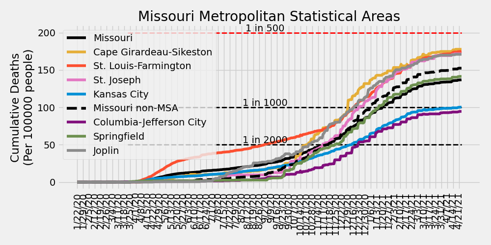

# COVID-19 Missouri Statistics & Regional Breakdowns
Author: Adam J. Vogt  
Updated: 02/07/2021  
Source: [COVID-19 Data Repository by the Center for Systems Science and Engineering (CSSE) at Johns Hopkins University](https://github.com/CSSEGISandData/COVID-19)  
Source Code: `/ajvogt-analysis/mo_analysis_script.py`  
[Release Notes found below](#release-notes)

This analysis shows the Johns Hopkins University COVID-19 data broken down by 
[Metropolitan Statistcal Area](https://en.wikipedia.org/wiki/Metropolitan_statistical_area) (MSA)
 combinations within the state of Missouri. The list of counties in each MSA comibination can be found in the 
[table](#msa-counties) 
below. The [detailed map of MSAs](https://www2.census.gov/geo/maps/metroarea/us_wall/Sep2018/CBSA_WallMap_Sep2018.pdf) 
can be found here.  The clusters used in the charts and tables below 
are a custom combination of MSAs and 
[Combined Statistical Areas](https://en.wikipedia.org/wiki/Combined_statistical_area) (CSA). 
County populations are pulled from this 
[JHU CSSE repository file](https://github.com/ajvogt/COVID-19/blob/master/csse_covid_19_data/UID_ISO_FIPS_LookUp_Table.csv).

## Missouri New Daily Confirmed Cases by Metropolitan Statistcal Areas

## Missouri New Daily Deaths by Metropolitan Statistcal Areas

## Missouri Cumulative Deaths by Metropolitan Statistcal Areas

## Missouri Metropolitan Statistical Area Totals
<!-- msa_table start -->
| MSA | Total Deaths | Total Cases | Daily New Cases: Last 7-Day Average | Daily New Cases: Last 14-Day Average | Daily New Cases: Last 30-Day Average |
|-----|-------|--------|---|---|---|
| St. Louis-Farmington | 4145 | 247213 | 727 | 815 | 1116 |
| Kansas City | 2212 | 168587 | 486 | 625 | 847 |
| Missouri non-MSA | 1822 | 107599 | 223 | 248 | 367 |
| Springfield | 553 | 35241 | 82 | 97 | 142 |
| Columbia-Jefferson City | 277 | 33780 | 80 | 79 | 101 |
| Joplin | 270 | 15865 | 48 | 50 | 59 |
| Cape Girardeau-Sikeston | 207 | 12550 | 29 | 28 | 34 |
| St. Joseph | 185 | 9924 | 19 | 22 | 31 |
<!-- msa_table end -->

## STL-Farmington MSA New Daily Confirmed Cases by County

## STL-Farmington MSA New Daily Deaths by County

## STL-Farmington MSA Cumulative Deaths by County

## Metropolitan Statistical Area (MSA) Counties
<!-- county_table start -->
| MSA | State | County | Total Deaths | Total Cases | Daily New Cases: Last 7-Day Average | Daily New Cases: Last 14-Day Average | Daily New Cases: Last 30-Day Average |
|-----|-------|--------|---|---|---|---|---|
| St. Louis-Farmington | Missouri | St. Louis | 1773 | 85062 | 245 | 306 | 392 |
| Kansas City | Kansas | Johnson | 682 | 50922 | 183 | 216 | 318 |
| St. Louis-Farmington | Illinois | Madison | 437 | 26763 | 104 | 111 | 150 |
| St. Louis-Farmington | Illinois | St. Clair | 437 | 24257 | 91 | 96 | 130 |
| Kansas City | Missouri | Jackson | 326 | 28972 | 87 | 118 | 141 |
| St. Louis-Farmington | Missouri | St. Louis City | 367 | 20669 | 64 | 54 | 73 |
| St. Louis-Farmington | Missouri | St. Charles | 378 | 31908 | 63 | 70 | 114 |
| Kansas City | Missouri | Kansas City | 458 | 35959 | 62 | 110 | 141 |
| Springfield | Missouri | Greene | 388 | 22692 | 54 | 63 | 92 |
| St. Louis-Farmington | Missouri | Jefferson | 183 | 18517 | 48 | 54 | 81 |
| Kansas City | Kansas | Wyandotte | 245 | 18414 | 42 | 47 | 70 |
| Joplin | Missouri | Jasper | 208 | 11882 | 40 | 41 | 47 |
| Columbia-Jefferson City | Missouri | Boone | 69 | 15553 | 39 | 41 | 53 |
| Kansas City | Kansas | Leavenworth | 66 | 6378 | 27 | 29 | 36 |
| Kansas City | Missouri | Clay | 131 | 7644 | 25 | 27 | 34 |
| Cape Girardeau-Sikeston | Missouri | Cape Girardeau | 116 | 7371 | 20 | 19 | 21 |
| St. Louis-Farmington | Illinois | Clinton | 85 | 5449 | 20 | 20 | 25 |
| St. Louis-Farmington | Missouri | Franklin | 138 | 8159 | 20 | 23 | 38 |
| Springfield | Missouri | Christian | 71 | 6703 | 19 | 20 | 28 |
| Kansas City | Missouri | Cass | 72 | 6989 | 18 | 27 | 37 |
| Columbia-Jefferson City | Missouri | Cole | 107 | 8459 | 16 | 15 | 19 |
| St. Louis-Farmington | Illinois | Monroe | 75 | 3909 | 15 | 17 | 19 |
| Columbia-Jefferson City | Missouri | Callaway | 37 | 4362 | 14 | 12 | 13 |
| St. Louis-Farmington | Missouri | St. Francois | 92 | 7443 | 14 | 13 | 20 |
| St. Joseph | Missouri | Buchanan | 126 | 6842 | 12 | 14 | 20 |
| Kansas City | Missouri | Platte | 37 | 2998 | 12 | 12 | 13 |
| St. Louis-Farmington | Illinois | Macoupin | 73 | 4211 | 12 | 14 | 25 |
| Missouri non-MSA | Missouri | Pettis | 71 | 4688 | 10 | 10 | 15 |
| St. Louis-Farmington | Missouri | Lincoln | 27 | 4147 | 9 | 12 | 14 |
| Missouri non-MSA | Missouri | Johnson | 38 | 3733 | 9 | 9 | 13 |
| Missouri non-MSA | Missouri | Butler | 27 | 3289 | 9 | 9 | 12 |
| Kansas City | Missouri | Lafayette | 48 | 2466 | 9 | 8 | 9 |
| Missouri non-MSA | Missouri | Taney | 73 | 4467 | 9 | 11 | 17 |
| Missouri non-MSA | Missouri | Laclede | 64 | 2884 | 8 | 8 | 8 |
| Missouri non-MSA | Missouri | Camden | 75 | 3664 | 8 | 8 | 12 |
| Joplin | Missouri | Newton | 62 | 3983 | 7 | 9 | 12 |
| St. Louis-Farmington | Illinois | Jersey | 44 | 2405 | 7 | 7 | 11 |
| Missouri non-MSA | Missouri | Saline | 33 | 2379 | 6 | 6 | 8 |
| Missouri non-MSA | Missouri | Lawrence | 65 | 2686 | 6 | 6 | 8 |
| Missouri non-MSA | Missouri | Stone | 33 | 1971 | 6 | 7 | 8 |
| Missouri non-MSA | Missouri | Stoddard | 35 | 2269 | 5 | 5 | 6 |
| St. Louis-Farmington | Missouri | Warren | 13 | 2023 | 5 | 6 | 9 |
| Cape Girardeau-Sikeston | Missouri | Scott | 71 | 3711 | 5 | 5 | 8 |
| Missouri non-MSA | Missouri | Phelps | 115 | 2920 | 5 | 5 | 10 |
| Missouri non-MSA | Missouri | Ripley | 11 | 821 | 5 | 4 | 4 |
| Kansas City | Kansas | Miami | 30 | 2517 | 5 | 9 | 17 |
| Missouri non-MSA | Missouri | Barry | 43 | 2138 | 5 | 5 | 8 |
| Missouri non-MSA | Missouri | Henry | 30 | 1682 | 4 | 5 | 6 |
| Missouri non-MSA | Missouri | Pulaski | 37 | 2938 | 4 | 4 | 10 |
| Missouri non-MSA | Missouri | Adair | 11 | 2013 | 4 | 5 | 9 |
| Missouri non-MSA | Missouri | Audrain | 51 | 2044 | 4 | 5 | 6 |
| Missouri non-MSA | Missouri | Benton | 23 | 1417 | 4 | 3 | 4 |
| Missouri non-MSA | Missouri | Marion | 39 | 2610 | 4 | 3 | 6 |
| Kansas City | Missouri | Ray | 22 | 1436 | 4 | 5 | 7 |
| Missouri non-MSA | Missouri | Dunklin | 17 | 2373 | 4 | 4 | 7 |
| Missouri non-MSA | Missouri | Carroll | 21 | 814 | 4 | 4 | 4 |
| Springfield | Missouri | Webster | 46 | 2954 | 4 | 7 | 12 |
| Missouri non-MSA | Missouri | Crawford | 28 | 2010 | 3 | 4 | 7 |
| Missouri non-MSA | Missouri | Livingston | 32 | 1294 | 3 | 4 | 6 |
| Columbia-Jefferson City | Missouri | Cooper | 21 | 1666 | 3 | 3 | 4 |
| Kansas City | Missouri | Clinton | 60 | 1493 | 3 | 4 | 5 |
| Missouri non-MSA | Missouri | Vernon | 33 | 1351 | 3 | 3 | 6 |
| Springfield | Missouri | Polk | 26 | 2091 | 3 | 4 | 6 |
| Kansas City | Missouri | Bates | 19 | 1053 | 3 | 4 | 5 |
| Missouri non-MSA | Missouri | Texas | 21 | 1520 | 3 | 2 | 3 |
| Missouri non-MSA | Missouri | Pike | 21 | 1467 | 3 | 3 | 5 |
| Missouri non-MSA | Missouri | Washington | 42 | 2088 | 3 | 4 | 7 |
| Missouri non-MSA | Missouri | Wright | 26 | 1348 | 3 | 4 | 6 |
| Columbia-Jefferson City | Missouri | Osage | 12 | 1376 | 3 | 3 | 4 |
| St. Louis-Farmington | Illinois | Bond | 21 | 1829 | 3 | 3 | 6 |
| Missouri non-MSA | Missouri | Grundy | 32 | 814 | 3 | 2 | 3 |
| Missouri non-MSA | Missouri | Harrison | 14 | 813 | 3 | 4 | 5 |
| Missouri non-MSA | Missouri | Ste. Genevieve | 13 | 1588 | 3 | 3 | 3 |
| Missouri non-MSA | Missouri | Howell | 42 | 2756 | 2 | 4 | 9 |
| Missouri non-MSA | Missouri | New Madrid | 43 | 1761 | 2 | 2 | 3 |
| St. Joseph | Kansas | Doniphan | 16 | 913 | 2 | 4 | 5 |
| Missouri non-MSA | Missouri | Ozark | 11 | 537 | 2 | 2 | 4 |
| Missouri non-MSA | Missouri | Perry | 22 | 2011 | 2 | 2 | 3 |
| Missouri non-MSA | Missouri | Macon | 12 | 1179 | 2 | 4 | 6 |
| Missouri non-MSA | Missouri | McDonald | 25 | 1887 | 2 | 3 | 5 |
| Missouri non-MSA | Missouri | Morgan | 37 | 1607 | 2 | 2 | 3 |
| Missouri non-MSA | Missouri | Daviess | 11 | 580 | 2 | 2 | 3 |
| Missouri non-MSA | Missouri | Shannon | 10 | 474 | 2 | 1 | 1 |
| Missouri non-MSA | Missouri | St. Clair | 7 | 571 | 2 | 2 | 2 |
| Missouri non-MSA | Missouri | Miller | 48 | 2294 | 2 | 3 | 5 |
| Columbia-Jefferson City | Missouri | Moniteau | 27 | 1667 | 2 | 2 | 3 |
| Missouri non-MSA | Missouri | Clark | 6 | 453 | 2 | 1 | 2 |
| Missouri non-MSA | Missouri | Barton | 10 | 933 | 2 | 2 | 4 |
| St. Joseph | Missouri | Andrew | 17 | 1262 | 2 | 2 | 3 |
| St. Joseph | Missouri | DeKalb | 26 | 907 | 2 | 2 | 3 |
| Missouri non-MSA | Missouri | Cedar | 10 | 656 | 2 | 2 | 3 |
| Missouri non-MSA | Missouri | Pemiscot | 25 | 1396 | 1 | 2 | 2 |
| Cape Girardeau-Sikeston | Illinois | Alexander | 8 | 426 | 1 | 1 | 2 |
| Missouri non-MSA | Missouri | Mississippi | 22 | 1233 | 1 | 2 | 2 |
| Missouri non-MSA | Missouri | Wayne | 9 | 800 | 1 | 2 | 3 |
| Springfield | Missouri | Dallas | 22 | 801 | 1 | 2 | 2 |
| Cape Girardeau-Sikeston | Missouri | Bollinger | 12 | 1042 | 1 | 1 | 2 |
| Missouri non-MSA | Missouri | Gasconade | 36 | 853 | 1 | 2 | 4 |
| Kansas City | Kansas | Linn | 6 | 721 | 1 | 3 | 4 |
| Missouri non-MSA | Missouri | Randolph | 27 | 1796 | 1 | 1 | 4 |
| Missouri non-MSA | Missouri | Douglas | 23 | 755 | 1 | 1 | 3 |
| Missouri non-MSA | Missouri | Gentry | 19 | 725 | 1 | 2 | 2 |
| Missouri non-MSA | Missouri | Madison | 15 | 1340 | 1 | 2 | 2 |
| Missouri non-MSA | Missouri | Dent | 14 | 809 | 1 | 2 | 2 |
| St. Louis-Farmington | Illinois | Calhoun | 2 | 462 | 1 | 0 | 2 |
| Missouri non-MSA | Missouri | Linn | 10 | 532 | 1 | 2 | 3 |
| Missouri non-MSA | Missouri | Maries | 7 | 527 | 1 | 1 | 1 |
| Kansas City | Missouri | Caldwell | 10 | 625 | 1 | 1 | 1 |
| Missouri non-MSA | Missouri | Chariton | 3 | 408 | 0 | 0 | 1 |
| Columbia-Jefferson City | Missouri | Howard | 4 | 697 | 0 | 0 | 1 |
| Missouri non-MSA | Missouri | Holt | 10 | 362 | 0 | 0 | 0 |
| Missouri non-MSA | Missouri | Mercer | 2 | 166 | 0 | 0 | 0 |
| Missouri non-MSA | Missouri | Ralls | 12 | 742 | 0 | 0 | 1 |
| Missouri non-MSA | Missouri | Dade | 13 | 415 | 0 | 1 | 1 |
| Missouri non-MSA | Missouri | Monroe | 8 | 583 | 0 | 1 | 1 |
| Missouri non-MSA | Missouri | Carter | 8 | 414 | 0 | 0 | 0 |
| Missouri non-MSA | Missouri | Nodaway | 23 | 2525 | 0 | 2 | 3 |
| Missouri non-MSA | Missouri | Hickory | 11 | 462 | 0 | 0 | 0 |
| Missouri non-MSA | Missouri | Schuyler | 1 | 263 | 0 | 0 | 1 |
| Missouri non-MSA | Missouri | Oregon | 3 | 662 | 0 | 1 | 2 |
| Missouri non-MSA | Missouri | Knox | 2 | 175 | 0 | 0 | 0 |
| Missouri non-MSA | Missouri | Scotland | 3 | 240 | 0 | 0 | 0 |
| Missouri non-MSA | Missouri | Shelby | 6 | 349 | 0 | 0 | 1 |
| Missouri non-MSA | Missouri | Putnam | 2 | 219 | 0 | 0 | 0 |
| Missouri non-MSA | Missouri | Atchison | 6 | 290 | 0 | 0 | 0 |
| Missouri non-MSA | Missouri | Reynolds | 3 | 258 | 0 | 0 | 0 |
| Missouri non-MSA | Missouri | Lewis | 4 | 623 | 0 | 0 | 1 |
| Missouri non-MSA | Missouri | Sullivan | 13 | 742 | 0 | 0 | 2 |
| Missouri non-MSA | Missouri | Montgomery | 10 | 550 | 0 | 0 | 0 |
| Unassigned/Out of MO | Missouri | Unassigned | 0 | 0 | 0 | 0 | 0 |
| Unassigned/Out of MO | Missouri | Out of MO | 0 | 0 | 0 | 0 | 0 |
| Missouri non-MSA | Missouri | Worth | 1 | 137 | 0 | 0 | 0 |
| Missouri non-MSA | Missouri | Iron | 3 | 456 | 0 | 0 | 1 |
<!-- county_table end -->

## Release Notes

### Release Notes
* 1/17/2021: including cumulative deaths plots
* 1/4/2021: small fix for including 2021 data
* 7/20/2020:
  * update table insertion code
  * fix cases vs. deaths total header bug
  * include MSA totals table
  * added STL-Farmington County-level Deaths & Cases plots
  * including release notes in missouri_analysis.md
* 7/19/2020: 
  * code refactor
  * updating color scheme for plots
  * updating county numbers to table to include
  latest new daily case average numbers and
  sorting by last 7-day average
* 6/19/2020: Added description of MSAs & CSAs
* 6/16/2020: Including individual county totals (only) in analysis md table
* 6/11/2020:
  * Updated MSA definitions
  * Including table of individual county case counts
* 6/7/2020: Creating markdown & script
  * Including list of county-MSA/CSA associations to markdown
  * Including cumulative totals in MSA/CSA plots
* 5/30/2020: including plots of cumulative cases/deaths in jupyter notebook
* 5/17/2020: Initial analysis jupyter notebook created
* 4/4/2020: Cloned JHU CSSE Repository and set up development environment

### To-Do (updated 1/17/2021)
- [ ] Verify county population data

#### Analysis Page
- [x] Update description to accurately reflect CSA vs. MSA
- [x] Make table for CSA info
- [x] Include 7, 14, & 30 day changes for each county
- [ ] Plot top CSAs (for latest daily case change) with testing data
- [x] Analysis breakdown of St. Louis-Farmington counties
- [x] Include release notes and to-do list
- [ ] ~~Update color scheme~~, plot markers, and line thickness
- [ ] Include table of contents

#### Analysis Script
- [x] Simplify data ingestion and summarization functionality
- [x] Simplify plotting functionality
- [x] Include ability to update markdown with table between markdown sections
