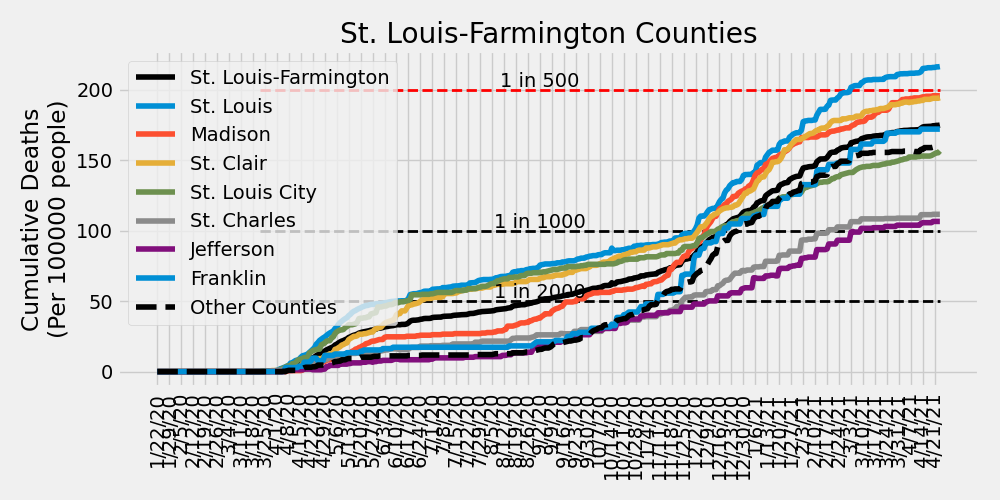

# COVID-19 Missouri Statistics & Regional Breakdowns
Author: Adam J. Vogt  
Updated: 01/20/2021  
Source: [COVID-19 Data Repository by the Center for Systems Science and Engineering (CSSE) at Johns Hopkins University](https://github.com/CSSEGISandData/COVID-19)  
Source Code: `/ajvogt-analysis/mo_analysis_script.py`  
[Release Notes found below](#release-notes)

This analysis shows the Johns Hopkins University COVID-19 data broken down by 
[Metropolitan Statistcal Area](https://en.wikipedia.org/wiki/Metropolitan_statistical_area) (MSA)
 combinations within the state of Missouri. The list of counties in each MSA comibination can be found in the 
[table](#msa-counties) 
below. The [detailed map of MSAs](https://www2.census.gov/geo/maps/metroarea/us_wall/Sep2018/CBSA_WallMap_Sep2018.pdf) 
can be found here.  The clusters used in the charts and tables below 
are a custom combination of MSAs and 
[Combined Statistical Areas](https://en.wikipedia.org/wiki/Combined_statistical_area) (CSA). 
County populations are pulled from this 
[JHU CSSE repository file](https://github.com/ajvogt/COVID-19/blob/master/csse_covid_19_data/UID_ISO_FIPS_LookUp_Table.csv).

## Missouri New Daily Confirmed Cases by Metropolitan Statistcal Areas

## Missouri New Daily Deaths by Metropolitan Statistcal Areas

## Missouri Cumulative Deaths by Metropolitan Statistcal Areas

## Missouri Metropolitan Statistical Area Totals
<!-- msa_table start -->
| MSA | Total Deaths | Total Cases | Daily New Cases: Last 7-Day Average | Daily New Cases: Last 14-Day Average | Daily New Cases: Last 30-Day Average |
|-----|-------|--------|---|---|---|
| St. Louis-Farmington | 3793 | 228627 | 1168 | 1410 | 1401 |
| Kansas City | 1916 | 155716 | 893 | 1099 | 1072 |
| Missouri non-MSA | 1587 | 102618 | 399 | 535 | 559 |
| Springfield | 482 | 33319 | 145 | 205 | 212 |
| Columbia-Jefferson City | 244 | 32223 | 103 | 142 | 150 |
| Joplin | 242 | 14907 | 63 | 75 | 73 |
| Cape Girardeau-Sikeston | 193 | 12025 | 36 | 49 | 51 |
| St. Joseph | 160 | 9483 | 32 | 44 | 46 |
<!-- msa_table end -->

## STL-Farmington MSA New Daily Confirmed Cases by County

## STL-Farmington MSA New Daily Deaths by County

## STL-Farmington MSA Cumulative Deaths by County

## Metropolitan Statistical Area (MSA) Counties
<!-- county_table start -->
| MSA | State | County | Total Deaths | Total Cases | Daily New Cases: Last 7-Day Average | Daily New Cases: Last 14-Day Average | Daily New Cases: Last 30-Day Average |
|-----|-------|--------|---|---|---|---|---|
| St. Louis-Farmington | Missouri | St. Louis | 1564 | 79030 | 417 | 509 | 488 |
| Kansas City | Kansas | Johnson | 603 | 46009 | 365 | 402 | 364 |
| St. Louis-Farmington | Illinois | Madison | 463 | 24398 | 165 | 183 | 171 |
| St. Louis-Farmington | Illinois | St. Clair | 426 | 22343 | 154 | 175 | 161 |
| Kansas City | Missouri | Kansas City | 382 | 33885 | 139 | 192 | 195 |
| Kansas City | Missouri | Jackson | 285 | 26775 | 132 | 180 | 175 |
| St. Louis-Farmington | Missouri | St. Charles | 316 | 30391 | 130 | 171 | 169 |
| Springfield | Missouri | Greene | 333 | 21443 | 94 | 131 | 137 |
| St. Louis-Farmington | Missouri | Jefferson | 153 | 17387 | 93 | 119 | 114 |
| Kansas City | Kansas | Wyandotte | 221 | 17419 | 89 | 99 | 110 |
| Columbia-Jefferson City | Missouri | Boone | 54 | 14698 | 54 | 72 | 73 |
| Joplin | Missouri | Jasper | 182 | 11110 | 49 | 58 | 55 |
| St. Louis-Farmington | Missouri | Franklin | 122 | 7664 | 46 | 57 | 55 |
| Kansas City | Missouri | Cass | 62 | 6459 | 39 | 50 | 46 |
| Kansas City | Kansas | Leavenworth | 52 | 5780 | 38 | 42 | 36 |
| Kansas City | Missouri | Clay | 119 | 7115 | 31 | 45 | 45 |
| St. Louis-Farmington | Illinois | Clinton | 85 | 5032 | 28 | 30 | 29 |
| Springfield | Missouri | Christian | 60 | 6298 | 28 | 40 | 42 |
| St. Louis-Farmington | Illinois | Macoupin | 94 | 3849 | 27 | 33 | 28 |
| Cape Girardeau-Sikeston | Missouri | Cape Girardeau | 106 | 7034 | 22 | 29 | 32 |
| St. Joseph | Missouri | Buchanan | 113 | 6569 | 21 | 27 | 28 |
| St. Louis-Farmington | Illinois | Monroe | 70 | 3587 | 20 | 24 | 25 |
| St. Louis-Farmington | Missouri | St. Francois | 79 | 7179 | 19 | 32 | 36 |
| Missouri non-MSA | Missouri | Taney | 60 | 4239 | 18 | 24 | 22 |
| Columbia-Jefferson City | Missouri | Cole | 101 | 8173 | 17 | 28 | 32 |
| St. Louis-Farmington | Missouri | St. Louis City | 302 | 17569 | 16 | 13 | 56 |
| Missouri non-MSA | Missouri | Pettis | 68 | 4473 | 16 | 23 | 22 |
| Missouri non-MSA | Missouri | Phelps | 103 | 2811 | 16 | 15 | 18 |
| Springfield | Missouri | Webster | 45 | 2803 | 15 | 19 | 18 |
| Missouri non-MSA | Missouri | Barry | 39 | 2039 | 14 | 13 | 11 |
| St. Louis-Farmington | Illinois | Jersey | 56 | 2225 | 14 | 12 | 15 |
| St. Louis-Farmington | Missouri | Lincoln | 24 | 3919 | 14 | 20 | 22 |
| Missouri non-MSA | Missouri | Howell | 41 | 2639 | 14 | 16 | 16 |
| Joplin | Missouri | Newton | 60 | 3797 | 14 | 17 | 17 |
| Columbia-Jefferson City | Missouri | Callaway | 29 | 4145 | 13 | 18 | 21 |
| Missouri non-MSA | Missouri | Johnson | 34 | 3552 | 13 | 18 | 17 |
| Kansas City | Missouri | Platte | 27 | 2793 | 12 | 19 | 21 |
| Kansas City | Kansas | Miami | 19 | 2221 | 12 | 20 | 23 |
| Missouri non-MSA | Missouri | Butler | 20 | 3096 | 12 | 14 | 15 |
| Missouri non-MSA | Missouri | Camden | 66 | 3510 | 12 | 20 | 19 |
| Missouri non-MSA | Missouri | Adair | 6 | 1880 | 11 | 14 | 15 |
| Missouri non-MSA | Missouri | Laclede | 55 | 2742 | 10 | 11 | 13 |
| St. Louis-Farmington | Missouri | Warren | 11 | 1876 | 9 | 12 | 12 |
| Missouri non-MSA | Missouri | Washington | 41 | 2000 | 9 | 11 | 10 |
| Cape Girardeau-Sikeston | Missouri | Scott | 68 | 3587 | 9 | 13 | 14 |
| Missouri non-MSA | Missouri | Stone | 28 | 1849 | 9 | 11 | 11 |
| Missouri non-MSA | Missouri | Randolph | 20 | 1764 | 9 | 9 | 8 |
| Missouri non-MSA | Missouri | Saline | 26 | 2244 | 8 | 12 | 12 |
| Missouri non-MSA | Missouri | Pulaski | 33 | 2864 | 8 | 19 | 20 |
| Missouri non-MSA | Missouri | Dunklin | 16 | 2272 | 8 | 10 | 9 |
| Kansas City | Missouri | Lafayette | 44 | 2295 | 7 | 11 | 13 |
| Missouri non-MSA | Missouri | Macon | 10 | 1071 | 7 | 8 | 7 |
| Missouri non-MSA | Missouri | Wright | 24 | 1273 | 7 | 9 | 10 |
| Missouri non-MSA | Missouri | Crawford | 21 | 1916 | 7 | 10 | 14 |
| Missouri non-MSA | Missouri | Vernon | 30 | 1285 | 7 | 10 | 13 |
| Kansas City | Missouri | Ray | 15 | 1318 | 7 | 10 | 11 |
| Missouri non-MSA | Missouri | Miller | 44 | 2218 | 7 | 9 | 10 |
| Columbia-Jefferson City | Missouri | Cooper | 21 | 1606 | 6 | 7 | 6 |
| Missouri non-MSA | Missouri | McDonald | 23 | 1821 | 6 | 8 | 8 |
| Missouri non-MSA | Missouri | Livingston | 25 | 1193 | 6 | 9 | 8 |
| Missouri non-MSA | Missouri | Henry | 25 | 1586 | 6 | 8 | 7 |
| Missouri non-MSA | Missouri | Stoddard | 34 | 2156 | 6 | 7 | 6 |
| St. Louis-Farmington | Illinois | Bond | 24 | 1738 | 6 | 10 | 10 |
| Kansas City | Kansas | Linn | 5 | 659 | 6 | 7 | 7 |
| Missouri non-MSA | Missouri | Ozark | 5 | 485 | 5 | 6 | 4 |
| Missouri non-MSA | Missouri | Pike | 17 | 1397 | 5 | 6 | 7 |
| Missouri non-MSA | Missouri | Gasconade | 31 | 798 | 5 | 6 | 6 |
| Kansas City | Missouri | Clinton | 60 | 1421 | 5 | 8 | 8 |
| Missouri non-MSA | Missouri | Harrison | 10 | 735 | 5 | 5 | 5 |
| Missouri non-MSA | Missouri | Audrain | 44 | 1954 | 5 | 8 | 15 |
| Missouri non-MSA | Missouri | Marion | 32 | 2520 | 5 | 8 | 10 |
| Missouri non-MSA | Missouri | Nodaway | 22 | 2477 | 5 | 7 | 8 |
| Springfield | Missouri | Polk | 25 | 2018 | 5 | 10 | 10 |
| Missouri non-MSA | Missouri | Texas | 20 | 1475 | 5 | 6 | 7 |
| Columbia-Jefferson City | Missouri | Moniteau | 26 | 1620 | 4 | 6 | 6 |
| St. Joseph | Kansas | Doniphan | 10 | 843 | 4 | 6 | 7 |
| Missouri non-MSA | Missouri | Benton | 19 | 1346 | 4 | 7 | 7 |
| Missouri non-MSA | Missouri | Barton | 9 | 883 | 4 | 6 | 5 |
| Missouri non-MSA | Missouri | Wayne | 9 | 758 | 4 | 5 | 4 |
| Missouri non-MSA | Missouri | Clark | 5 | 420 | 4 | 3 | 2 |
| Missouri non-MSA | Missouri | Dent | 9 | 771 | 4 | 3 | 4 |
| Missouri non-MSA | Missouri | Grundy | 28 | 776 | 4 | 5 | 4 |
| Columbia-Jefferson City | Missouri | Osage | 9 | 1306 | 4 | 6 | 6 |
| Kansas City | Missouri | Bates | 14 | 968 | 4 | 6 | 8 |
| Missouri non-MSA | Missouri | Douglas | 20 | 715 | 3 | 4 | 5 |
| Missouri non-MSA | Missouri | Morgan | 31 | 1567 | 3 | 6 | 6 |
| Missouri non-MSA | Missouri | Cedar | 9 | 612 | 3 | 4 | 4 |
| Missouri non-MSA | Missouri | Gentry | 17 | 683 | 3 | 4 | 4 |
| Missouri non-MSA | Missouri | Lewis | 3 | 607 | 3 | 3 | 3 |
| St. Joseph | Missouri | DeKalb | 21 | 860 | 3 | 4 | 4 |
| Missouri non-MSA | Missouri | Sullivan | 12 | 726 | 3 | 3 | 3 |
| Missouri non-MSA | Missouri | Carroll | 18 | 738 | 3 | 4 | 4 |
| Missouri non-MSA | Missouri | Linn | 9 | 484 | 3 | 4 | 3 |
| Missouri non-MSA | Missouri | Ste. Genevieve | 11 | 1521 | 3 | 4 | 7 |
| Missouri non-MSA | Missouri | Oregon | 3 | 636 | 2 | 5 | 4 |
| St. Louis-Farmington | Illinois | Calhoun | 4 | 440 | 2 | 2 | 2 |
| Cape Girardeau-Sikeston | Illinois | Alexander | 7 | 389 | 2 | 2 | 2 |
| Missouri non-MSA | Missouri | Perry | 22 | 1954 | 2 | 4 | 6 |
| St. Joseph | Missouri | Andrew | 16 | 1211 | 2 | 5 | 6 |
| Missouri non-MSA | Missouri | Lawrence | 60 | 2550 | 2 | 10 | 12 |
| Missouri non-MSA | Missouri | Ripley | 9 | 747 | 2 | 4 | 4 |
| Missouri non-MSA | Missouri | Pemiscot | 23 | 1353 | 2 | 3 | 4 |
| Springfield | Missouri | Dallas | 19 | 757 | 2 | 3 | 2 |
| Missouri non-MSA | Missouri | Chariton | 3 | 381 | 2 | 2 | 2 |
| Columbia-Jefferson City | Missouri | Howard | 4 | 675 | 2 | 2 | 2 |
| Missouri non-MSA | Missouri | New Madrid | 39 | 1705 | 2 | 5 | 5 |
| Missouri non-MSA | Missouri | Madison | 11 | 1293 | 2 | 3 | 6 |
| Kansas City | Missouri | Caldwell | 8 | 599 | 1 | 2 | 3 |
| Cape Girardeau-Sikeston | Missouri | Bollinger | 12 | 1015 | 1 | 3 | 2 |
| Missouri non-MSA | Missouri | Maries | 7 | 503 | 1 | 1 | 2 |
| Missouri non-MSA | Missouri | Shannon | 9 | 449 | 1 | 2 | 1 |
| Missouri non-MSA | Missouri | Daviess | 10 | 531 | 1 | 3 | 3 |
| Missouri non-MSA | Missouri | St. Clair | 5 | 514 | 1 | 2 | 3 |
| Missouri non-MSA | Missouri | Mississippi | 20 | 1180 | 1 | 2 | 3 |
| Missouri non-MSA | Missouri | Montgomery | 9 | 545 | 1 | 1 | 3 |
| Missouri non-MSA | Missouri | Hickory | 9 | 454 | 1 | 1 | 1 |
| Missouri non-MSA | Missouri | Shelby | 4 | 330 | 1 | 1 | 1 |
| Missouri non-MSA | Missouri | Iron | 1 | 453 | 1 | 2 | 4 |
| Missouri non-MSA | Missouri | Ralls | 9 | 718 | 1 | 2 | 3 |
| Missouri non-MSA | Missouri | Reynolds | 2 | 253 | 1 | 1 | 1 |
| Missouri non-MSA | Missouri | Schuyler | 1 | 239 | 1 | 1 | 2 |
| Missouri non-MSA | Missouri | Knox | 2 | 164 | 1 | 0 | 0 |
| Missouri non-MSA | Missouri | Dade | 10 | 395 | 1 | 1 | 1 |
| Missouri non-MSA | Missouri | Monroe | 7 | 562 | 1 | 1 | 2 |
| Missouri non-MSA | Missouri | Mercer | 2 | 156 | 0 | 1 | 1 |
| Missouri non-MSA | Missouri | Carter | 7 | 405 | 0 | 1 | 1 |
| Missouri non-MSA | Missouri | Holt | 9 | 346 | 0 | 1 | 1 |
| Missouri non-MSA | Missouri | Worth | 1 | 132 | 0 | 0 | 0 |
| Missouri non-MSA | Missouri | Putnam | 2 | 209 | 0 | 0 | 0 |
| Missouri non-MSA | Missouri | Atchison | 6 | 286 | 0 | 1 | 1 |
| Missouri non-MSA | Missouri | Scotland | 3 | 234 | 0 | 0 | 0 |
| Unassigned/Out of MO | Missouri | Unassigned | 0 | 0 | 0 | 0 | 0 |
| Unassigned/Out of MO | Missouri | Out of MO | 0 | 0 | 0 | 0 | 0 |
<!-- county_table end -->

## Release Notes

### Release Notes
* 1/17/2021: including cumulative deaths plots
* 1/4/2021: small fix for including 2021 data
* 7/20/2020:
  * update table insertion code
  * fix cases vs. deaths total header bug
  * include MSA totals table
  * added STL-Farmington County-level Deaths & Cases plots
  * including release notes in missouri_analysis.md
* 7/19/2020: 
  * code refactor
  * updating color scheme for plots
  * updating county numbers to table to include
  latest new daily case average numbers and
  sorting by last 7-day average
* 6/19/2020: Added description of MSAs & CSAs
* 6/16/2020: Including individual county totals (only) in analysis md table
* 6/11/2020:
  * Updated MSA definitions
  * Including table of individual county case counts
* 6/7/2020: Creating markdown & script
  * Including list of county-MSA/CSA associations to markdown
  * Including cumulative totals in MSA/CSA plots
* 5/30/2020: including plots of cumulative cases/deaths in jupyter notebook
* 5/17/2020: Initial analysis jupyter notebook created
* 4/4/2020: Cloned JHU CSSE Repository and set up development environment

### To-Do (updated 1/17/2021)
- [ ] Verify county population data

#### Analysis Page
- [x] Update description to accurately reflect CSA vs. MSA
- [x] Make table for CSA info
- [x] Include 7, 14, & 30 day changes for each county
- [ ] Plot top CSAs (for latest daily case change) with testing data
- [x] Analysis breakdown of St. Louis-Farmington counties
- [x] Include release notes and to-do list
- [ ] ~~Update color scheme~~, plot markers, and line thickness
- [ ] Include table of contents

#### Analysis Script
- [x] Simplify data ingestion and summarization functionality
- [x] Simplify plotting functionality
- [x] Include ability to update markdown with table between markdown sections
