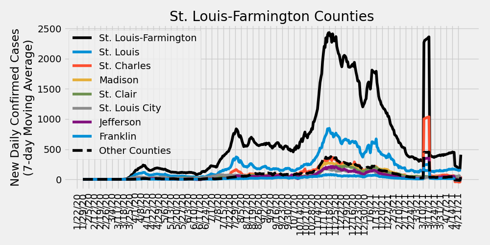

# COVID-19 Missouri Statistics & Regional Breakdowns
Author: Adam J. Vogt  
Updated: 08/07/2020  
Source: [COVID-19 Data Repository by the Center for Systems Science and Engineering (CSSE) at Johns Hopkins University](https://github.com/CSSEGISandData/COVID-19)  
Source Code: `/ajvogt-analysis/mo_analysis_script.py`  
[Release Notes found below](#release-notes)

This analysis shows the Johns Hopkins University COVID-19 data broken down by 
[Metropolitan Statistcal Area](https://en.wikipedia.org/wiki/Metropolitan_statistical_area) (MSA)
 combinations within the state of Missouri. The list of counties in each MSA comibination can be found in the 
[table](#msa-counties) 
below. The [detailed map of MSAs](https://www2.census.gov/geo/maps/metroarea/us_wall/Sep2018/CBSA_WallMap_Sep2018.pdf) 
can be found here.  The clusters used in the charts and tables below 
are a custom combination of MSAs and 
[Combined Statistical Areas](https://en.wikipedia.org/wiki/Combined_statistical_area) (CSA).

## Missouri New Daily Deaths by Metropolitan Statistcal Areas

## Missouri New Daily Confirmed Cases by Metropolitan Statistcal Areas

## Missouri Metropolitan Statistical Area Totals
<!-- msa_table start -->
| MSA | Total Deaths | Total Cases | Daily New Cases: Last 7-Day Average | Daily New Cases: Last 14-Day Average | Daily New Cases: Last 30-Day Average |
|-----|-------|--------|---|---|---|
| St. Louis-Farmington | 1226 | 33479 | 650 | 758 | 597 |
| Kansas City | 371 | 24421 | 406 | 485 | 432 |
| Missouri non-MSA | 95 | 8852 | 186 | 209 | 169 |
| Springfield | 13 | 2110 | 56 | 70 | 53 |
| Columbia-Jefferson City | 10 | 2136 | 54 | 60 | 47 |
| Joplin | 34 | 2550 | 23 | 34 | 40 |
| Cape Girardeau-Sikeston | 19 | 1093 | 13 | 16 | 20 |
| St. Joseph | 12 | 1246 | 6 | 7 | 7 |
<!-- msa_table end -->

## STL-Farmington MSA New Daily Deaths by County

## STL-Farmington MSA New Daily Confirmed Cases by County

## Metropolitan Statistical Area (MSA) Counties
<!-- county_table start -->
| MSA | State | County | Total Deaths | Total Cases | Daily New Cases: Last 7-Day Average | Daily New Cases: Last 14-Day Average | Daily New Cases: Last 30-Day Average |
|-----|-------|--------|---|---|---|---|---|
| St. Louis-Farmington | Missouri | St. Louis | 653 | 14362 | 259 | 315 | 243 |
| Kansas City | Missouri | Kansas City | 58 | 6365 | 99 | 142 | 118 |
| Kansas City | Kansas | Johnson | 102 | 5439 | 94 | 91 | 102 |
| Kansas City | Missouri | Jackson | 62 | 3810 | 88 | 112 | 80 |
| St. Louis-Farmington | Missouri | St. Charles | 87 | 3895 | 86 | 124 | 90 |
| St. Louis-Farmington | Missouri | St. Louis City | 171 | 5002 | 84 | 90 | 78 |
| St. Louis-Farmington | Illinois | St. Clair | 159 | 3845 | 60 | 63 | 59 |
| Kansas City | Kansas | Wyandotte | 98 | 4740 | 59 | 60 | 70 |
| St. Louis-Farmington | Illinois | Madison | 74 | 2410 | 51 | 54 | 45 |
| St. Louis-Farmington | Missouri | Jefferson | 24 | 1510 | 39 | 48 | 33 |
| Springfield | Missouri | Greene | 10 | 1400 | 39 | 48 | 34 |
| Columbia-Jefferson City | Missouri | Boone | 3 | 1297 | 24 | 32 | 27 |
| Missouri non-MSA | Missouri | Taney | 3 | 521 | 21 | 22 | 13 |
| Kansas City | Missouri | Clay | 20 | 984 | 18 | 21 | 15 |
| Kansas City | Missouri | Cass | 9 | 692 | 14 | 22 | 17 |
| Joplin | Missouri | Jasper | 28 | 1706 | 14 | 24 | 29 |
| St. Louis-Farmington | Missouri | Franklin | 18 | 586 | 13 | 12 | 11 |
| Columbia-Jefferson City | Missouri | Cole | 3 | 362 | 13 | 11 | 8 |
| Missouri non-MSA | Missouri | Pettis | 3 | 473 | 13 | 17 | 11 |
| St. Louis-Farmington | Missouri | Lincoln | 1 | 352 | 11 | 11 | 8 |
| Springfield | Missouri | Christian | 1 | 324 | 10 | 12 | 9 |
| St. Louis-Farmington | Missouri | St. Francois | 2 | 344 | 10 | 9 | 6 |
| Kansas City | Kansas | Leavenworth | 8 | 1444 | 9 | 9 | 8 |
| Joplin | Missouri | Newton | 6 | 844 | 9 | 9 | 11 |
| Missouri non-MSA | Missouri | Camden | 5 | 335 | 8 | 13 | 8 |
| St. Louis-Farmington | Illinois | Clinton | 17 | 378 | 8 | 6 | 4 |
| Missouri non-MSA | Missouri | New Madrid | 1 | 216 | 7 | 6 | 5 |
| Missouri non-MSA | Missouri | Dunklin | 4 | 288 | 7 | 8 | 5 |
| St. Louis-Farmington | Illinois | Monroe | 13 | 299 | 7 | 6 | 5 |
| Cape Girardeau-Sikeston | Missouri | Cape Girardeau | 5 | 627 | 7 | 8 | 12 |
| St. Louis-Farmington | Missouri | Warren | 0 | 189 | 6 | 6 | 4 |
| Missouri non-MSA | Missouri | Marion | 1 | 171 | 6 | 7 | 4 |
| Kansas City | Missouri | Platte | 10 | 338 | 6 | 7 | 6 |
| Kansas City | Missouri | Ray | 0 | 117 | 5 | 5 | 2 |
| Cape Girardeau-Sikeston | Missouri | Scott | 13 | 368 | 5 | 6 | 6 |
| Missouri non-MSA | Missouri | Butler | 2 | 264 | 5 | 6 | 5 |
| Missouri non-MSA | Missouri | Nodaway | 0 | 174 | 5 | 8 | 5 |
| Columbia-Jefferson City | Missouri | Cooper | 0 | 111 | 4 | 5 | 2 |
| Missouri non-MSA | Missouri | Pemiscot | 9 | 227 | 4 | 3 | 3 |
| Missouri non-MSA | Missouri | Lawrence | 2 | 205 | 4 | 5 | 5 |
| Columbia-Jefferson City | Missouri | Moniteau | 2 | 138 | 4 | 4 | 2 |
| Missouri non-MSA | Missouri | Barry | 2 | 245 | 4 | 4 | 5 |
| Missouri non-MSA | Missouri | Stone | 1 | 111 | 4 | 4 | 3 |
| Missouri non-MSA | Missouri | Johnson | 2 | 476 | 4 | 5 | 9 |
| St. Louis-Farmington | Illinois | Macoupin | 3 | 154 | 4 | 3 | 3 |
| Columbia-Jefferson City | Missouri | Callaway | 1 | 137 | 4 | 3 | 2 |
| Missouri non-MSA | Missouri | McDonald | 7 | 946 | 4 | 6 | 9 |
| Missouri non-MSA | Missouri | Crawford | 0 | 69 | 4 | 2 | 1 |
| Missouri non-MSA | Missouri | Miller | 1 | 111 | 4 | 4 | 3 |
| Missouri non-MSA | Missouri | Wayne | 0 | 52 | 4 | 3 | 1 |
| St. Joseph | Missouri | Buchanan | 10 | 1075 | 3 | 5 | 5 |
| Kansas City | Missouri | Lafayette | 2 | 171 | 3 | 3 | 2 |
| St. Louis-Farmington | Illinois | Jersey | 1 | 85 | 3 | 2 | 1 |
| Missouri non-MSA | Missouri | Perry | 4 | 218 | 3 | 2 | 1 |
| Missouri non-MSA | Missouri | Douglas | 2 | 84 | 3 | 3 | 2 |
| Missouri non-MSA | Missouri | Saline | 7 | 421 | 3 | 4 | 4 |
| Missouri non-MSA | Missouri | Howell | 2 | 145 | 3 | 5 | 3 |
| Missouri non-MSA | Missouri | Benton | 1 | 87 | 3 | 2 | 2 |
| Springfield | Missouri | Webster | 1 | 128 | 3 | 2 | 2 |
| Missouri non-MSA | Missouri | Adair | 0 | 150 | 2 | 2 | 1 |
| Missouri non-MSA | Missouri | Shelby | 0 | 31 | 2 | 1 | 0 |
| Missouri non-MSA | Missouri | Pike | 1 | 86 | 2 | 2 | 1 |
| Missouri non-MSA | Missouri | Pulaski | 1 | 195 | 2 | 2 | 2 |
| Missouri non-MSA | Missouri | Knox | 0 | 26 | 2 | 1 | 0 |
| Kansas City | Kansas | Miami | 0 | 133 | 2 | 2 | 3 |
| Missouri non-MSA | Missouri | Texas | 0 | 47 | 2 | 2 | 1 |
| Missouri non-MSA | Missouri | Stoddard | 9 | 220 | 2 | 2 | 2 |
| Missouri non-MSA | Missouri | Phelps | 0 | 84 | 2 | 1 | 1 |
| Missouri non-MSA | Missouri | Morgan | 0 | 76 | 2 | 2 | 1 |
| St. Louis-Farmington | Illinois | Bond | 3 | 59 | 2 | 2 | 1 |
| Missouri non-MSA | Missouri | Randolph | 1 | 64 | 2 | 2 | 1 |
| Springfield | Missouri | Polk | 0 | 200 | 2 | 4 | 6 |
| Missouri non-MSA | Missouri | Monroe | 0 | 26 | 1 | 1 | 0 |
| Kansas City | Missouri | Clinton | 0 | 72 | 1 | 1 | 1 |
| Missouri non-MSA | Missouri | Iron | 0 | 23 | 1 | 1 | 0 |
| Missouri non-MSA | Missouri | Washington | 1 | 67 | 1 | 1 | 1 |
| Columbia-Jefferson City | Missouri | Osage | 1 | 44 | 1 | 1 | 1 |
| Springfield | Missouri | Dallas | 1 | 58 | 1 | 1 | 1 |
| Missouri non-MSA | Missouri | Henry | 3 | 76 | 1 | 2 | 1 |
| Missouri non-MSA | Missouri | Lewis | 1 | 37 | 1 | 1 | 0 |
| Missouri non-MSA | Missouri | Clark | 0 | 18 | 1 | 1 | 0 |
| Kansas City | Missouri | Bates | 1 | 44 | 1 | 1 | 1 |
| Missouri non-MSA | Missouri | Carroll | 0 | 99 | 1 | 3 | 2 |
| Missouri non-MSA | Missouri | Maries | 0 | 20 | 1 | 0 | 0 |
| Missouri non-MSA | Missouri | Ripley | 0 | 48 | 1 | 0 | 0 |
| Missouri non-MSA | Missouri | Hickory | 0 | 25 | 1 | 1 | 0 |
| Missouri non-MSA | Missouri | Macon | 0 | 56 | 1 | 1 | 1 |
| Missouri non-MSA | Missouri | Montgomery | 0 | 41 | 1 | 1 | 0 |
| St. Joseph | Missouri | Andrew | 1 | 88 | 1 | 1 | 0 |
| Missouri non-MSA | Missouri | Sullivan | 0 | 140 | 1 | 1 | 0 |
| Missouri non-MSA | Missouri | Madison | 0 | 24 | 1 | 0 | 0 |
| Missouri non-MSA | Missouri | Audrain | 1 | 198 | 1 | 1 | 1 |
| Missouri non-MSA | Missouri | Livingston | 0 | 54 | 1 | 1 | 1 |
| Kansas City | Missouri | Caldwell | 1 | 36 | 1 | 0 | 0 |
| Cape Girardeau-Sikeston | Missouri | Bollinger | 1 | 62 | 1 | 0 | 1 |
| Kansas City | Kansas | Linn | 0 | 36 | 1 | 0 | 0 |
| Missouri non-MSA | Missouri | Putnam | 1 | 13 | 0 | 0 | 0 |
| Missouri non-MSA | Missouri | Wright | 0 | 60 | 0 | 0 | 1 |
| Missouri non-MSA | Missouri | Ste. Genevieve | 1 | 51 | 0 | 1 | 0 |
| Missouri non-MSA | Missouri | Carter | 1 | 20 | 0 | 0 | 0 |
| St. Joseph | Missouri | DeKalb | 1 | 36 | 0 | 0 | 0 |
| Missouri non-MSA | Missouri | Mississippi | 0 | 134 | 0 | 0 | 1 |
| Columbia-Jefferson City | Missouri | Howard | 0 | 47 | 0 | 1 | 1 |
| Missouri non-MSA | Missouri | Laclede | 1 | 191 | 0 | 2 | 4 |
| St. Louis-Farmington | Illinois | Calhoun | 0 | 9 | 0 | 0 | 0 |
| Missouri non-MSA | Missouri | Cedar | 0 | 37 | 0 | 0 | 0 |
| St. Joseph | Kansas | Doniphan | 0 | 47 | 0 | 0 | 0 |
| Missouri non-MSA | Missouri | Atchison | 0 | 14 | 0 | 0 | 0 |
| Missouri non-MSA | Missouri | St. Clair | 0 | 18 | 0 | 0 | 0 |
| Missouri non-MSA | Missouri | Ozark | 0 | 9 | 0 | 0 | 0 |
| Missouri non-MSA | Missouri | Scotland | 1 | 14 | 0 | 0 | 0 |
| Missouri non-MSA | Missouri | Vernon | 0 | 48 | 0 | 0 | 0 |
| Missouri non-MSA | Missouri | Mercer | 0 | 10 | 0 | 0 | 0 |
| Missouri non-MSA | Missouri | Chariton | 0 | 16 | 0 | 0 | 0 |
| Missouri non-MSA | Missouri | Barton | 0 | 66 | 0 | 1 | 1 |
| Missouri non-MSA | Missouri | Worth | 0 | 9 | 0 | 0 | 0 |
| Cape Girardeau-Sikeston | Illinois | Alexander | 0 | 36 | 0 | 0 | 0 |
| Missouri non-MSA | Missouri | Schuyler | 0 | 10 | 0 | 0 | 0 |
| Missouri non-MSA | Missouri | Ralls | 0 | 25 | 0 | 0 | 0 |
| Missouri non-MSA | Missouri | Oregon | 0 | 14 | 0 | 0 | 0 |
| Missouri non-MSA | Missouri | Harrison | 1 | 59 | 0 | 1 | 1 |
| Missouri non-MSA | Missouri | Grundy | 1 | 25 | 0 | 0 | 0 |
| Missouri non-MSA | Missouri | Gentry | 9 | 83 | 0 | 0 | 0 |
| Missouri non-MSA | Missouri | Gasconade | 0 | 20 | 0 | 0 | 0 |
| Missouri non-MSA | Missouri | Dent | 0 | 10 | 0 | 0 | 0 |
| Missouri non-MSA | Missouri | Shannon | 1 | 43 | 0 | 0 | 0 |
| Missouri non-MSA | Missouri | Reynolds | 0 | 16 | 0 | 0 | 0 |
| Missouri non-MSA | Missouri | Linn | 1 | 30 | 0 | 0 | 0 |
| Missouri non-MSA | Missouri | Holt | 0 | 6 | 0 | 0 | 0 |
| Missouri non-MSA | Missouri | Daviess | 0 | 17 | 0 | 0 | 0 |
| Missouri non-MSA | Missouri | Dade | 0 | 14 | 0 | 0 | 0 |
| Unassigned/Out of MO | Missouri | Out of MO | 0 | 0 | 0 | 0 | 0 |
| Unassigned/Out of MO | Missouri | Unassigned | 0 | 0 | 0 | 0 | 0 |
<!-- county_table end -->

## Release Notes

### Release Notes
* 7/20/2020:
  * update table insertion code
  * fix cases vs. deaths total header bug
  * include MSA totals table
  * added STL-Farmington County-level Deaths & Cases plots
  * including release notes in missouri_analysis.md
* 7/19/2020: 
  * code refactor
  * updating color scheme for plots
  * updating county numbers to table to include
  latest new daily case average numbers and
  sorting by last 7-day average
* 6/19/2020: Added description of MSAs & CSAs
* 6/16/2020: Including individual county totals (only) in analysis md table
* 6/11/2020:
  * Updated MSA definitions
  * Including table of individual county case counts
* 6/7/2020: Creating markdown & script
  * Including list of county-MSA/CSA associations to markdown
  * Including cumulative totals in MSA/CSA plots
* 5/30/2020: including plots of cumulative cases/deaths in jupyter notebook
* 5/17/2020: Initial analysis jupyter notebook created
* 4/4/2020: Cloned JHU CSSE Repository and set up development environment

### To-Do (updated 7/20/2020)

#### Analysis Page
- [ ] Update description to accurately reflect CSA vs. MSA
- [x] Make table for CSA info
- [x] Include 7, 14, & 30 day changes for each county
- [ ] Plot top CSAs (for latest daily case change) with testing data
- [x] Analysis breakdown of St. Louis-Farmington counties
- [x] Include release notes and to-do list
- [ ] ~~Update color scheme~~, plot markers, and line thickness
- [ ] Include table of contents

#### Analysis Script
- [x] Simplify data ingestion and summarization functionality
- [x] Simplify plotting functionality
- [x] Include ability to update markdown with table between markdown sections
